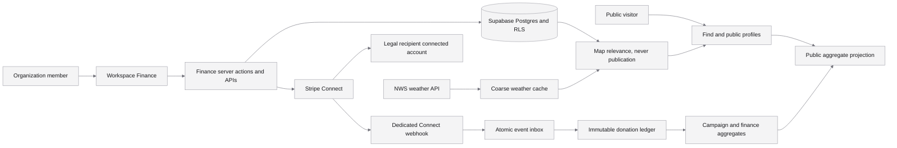
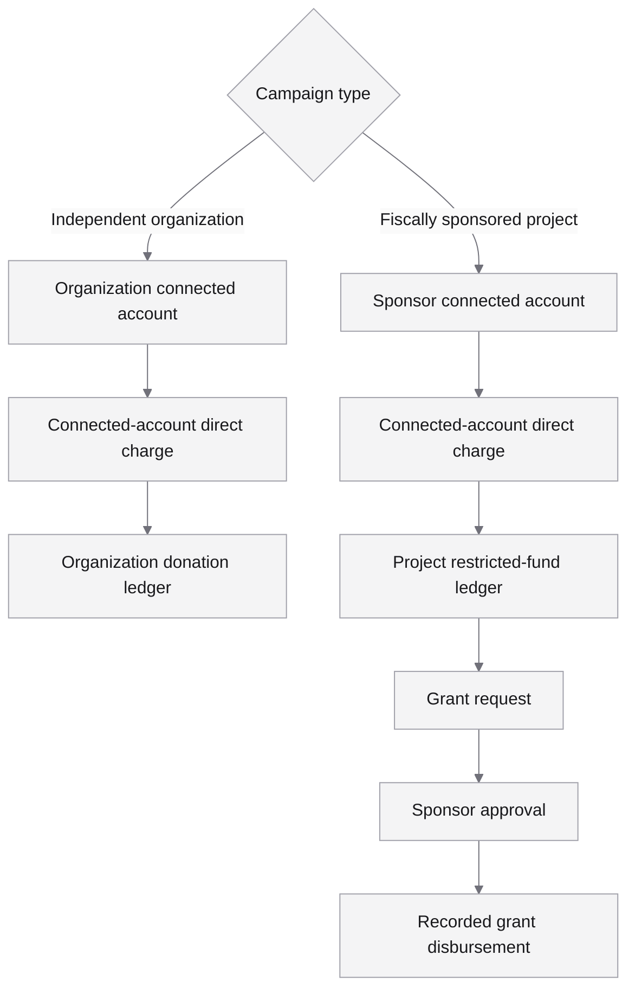
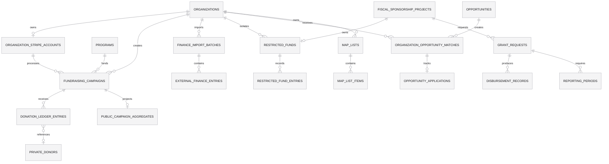
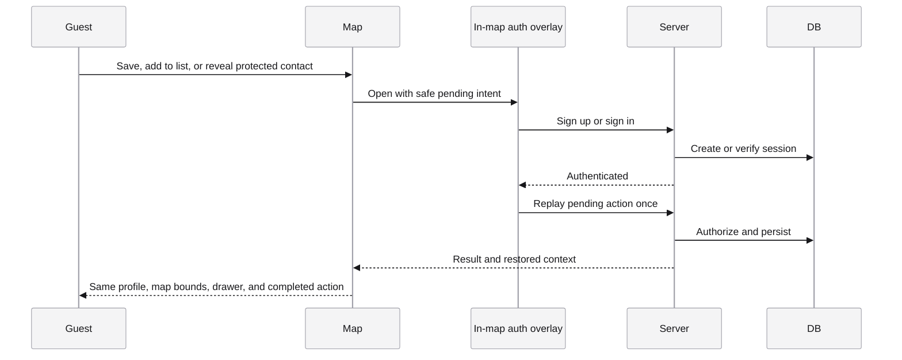
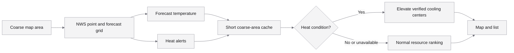
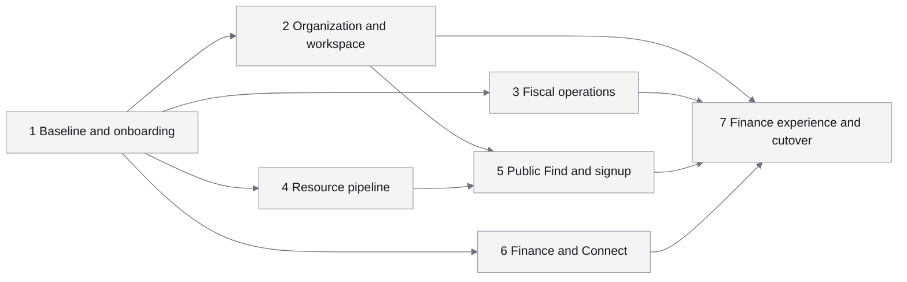

# Finance, Fundraising, Find, And Safe Release Plan

Status: design review; implementation blocked pending approval

Created: 2026-08-04

Last reviewed: 2026-08-04

Primary owners: product, platform engineering, fiscal sponsorship operations

## Decision Summary

Do not force-push or release the current staged tree.

Rebuild the work as seven sequential, independently reviewable branches from
the latest `origin/main`. Use the current branch only as a read-only donor for
intent and selected hunks. Merge behind inactive flags where needed and hold
the combined production rollout until Batch 7. Batch 1 may ship alone as an
approved onboarding incident hotfix.

The recommended product architecture is:

- Create Finance as its own workspace card and canonical identity. Do not reuse,
  rename, or replace `economic-engine`.
- Add Finance to the existing workspace drawer with Overview, Opportunities,
  Fundraising, and Reporting views.
- Give independent organizations full-dashboard Stripe connected accounts.
  Their connected account owns every Product, Price, Payment Link, charge,
  fee, refund, dispute, balance, and payout.
- Keep sponsor-held money in an append-only restricted-fund ledger isolated by
  organization and fiscal project. It remains backend financial truth and does
  not dictate Finance navigation, visual design, or workflow.
- Keep `/find/[slug]` as the canonical organization profile. Extend it with
  public programs and campaigns instead of creating a second profile system.
- Keep anonymous map context mounted during signup, replay the pending action
  after authentication, and never send private contact data in public payloads.
- Elevate verified cooling centers during heat conditions, but never hide them
  from search or claim that weather data proves a site is currently open.
- Grow public resources in verified cohorts. Never publish raw candidates,
  generated previews, or incomplete records to reach a numeric target.

## Approval Required Before Implementation

1. Confirm that fiscal-sponsorship grant funds are legally received by Coach
   House and allocated to the approved organization and project internally.
2. Confirm Coach House as the fiscal sponsor legal entity and merchant of
   record before sponsor-held payments work begins.
3. Confirm that the 7% fee applies only to fiscally sponsored grant allocations
   and is recorded as a sponsor-ledger effect. It never applies to ordinary
   fundraising and is never a Stripe application fee.
4. Complete the visual-reference review before final Finance UI implementation.
   The current drawer tabs and naming may remain in the meantime.

Draft 1 of the source-backed counsel and operations packet is
[`2026-08-06-fiscal-sponsorship-policy-approval-packet.md`](./2026-08-06-fiscal-sponsorship-policy-approval-packet.md).
It records the current handbook conflict, replacement copy, open fee mechanics,
ledger examples, and the required sign-off evidence. It is not legal approval.

### Fiscal custody options

| Option                       | Behavior                                                                               | Tradeoff                                                                                      |
| ---------------------------- | -------------------------------------------------------------------------------------- | --------------------------------------------------------------------------------------------- |
| A. Sponsor connected account | Sponsor legal entity owns the direct charge; project receives a restricted-fund credit | Recommended; matches fiscal custody, receipts, fee, grants, and reporting                     |
| B. Project connected account | Project owns the charge and payout                                                     | Satisfies no sponsor custody, but contradicts the current Model C fiscal workflow             |
| C. Defer sponsored donations | Independent organizations launch first; sponsored campaigns remain disabled            | Safest if legal ownership is unresolved, but leaves the fiscal fundraising journey incomplete |

If Coach House is the sponsor, Option A uses a sponsor-entity connected account,
not the platform subscription account. The platform software still never holds
or transfers the funds; the sponsor legal entity receives them as merchant of
record. Legal and accounting review must confirm that distinction and the
grant-only 7% treatment.

## Visual Reference Protocol

No image files were present in the supplied attachment directory on 2026-08-04.
Do not infer visual details that were supposed to come from them.

When references are attached:

1. Review all images before component work and record the layout hierarchy,
   density, typography, chart treatment, states, and explicitly rejected ideas.
2. Review them again after the Finance wireframe to remove duplicated metrics,
   repeated controls, and information shown before it is needed.
3. Review them again in desktop/mobile, empty/connected/error, and
   light/dark/reduced-motion browser passes before Batch 7 approval.
4. Keep the existing shadcn and Coach House design tokens. Images inform
   hierarchy; they do not justify copying inaccessible or incompatible chrome.

## Current-State Audit

### Release tree

Read-only checks on 2026-08-04 found:

| Condition                                       |                            Result |
| ----------------------------------------------- | --------------------------------: |
| Branch                                          | `agent/production-merge-20260804` |
| Commits behind `origin/main`                    |                                50 |
| Staged status entries                           |                               989 |
| Staged additions                                |                           157,525 |
| Staged deletions                                |                            41,927 |
| Delta from current `origin/main`                |                         710 files |
| Paths changed both upstream and locally         |                               684 |
| Divergent files requiring manual review         |                               405 |
| Origin-only changes missing from the index      |                               102 |
| Staged paths already identical to `origin/main` |                               381 |

A literal force-push now would push only the current commit, not the staged
index. It would rewind `main` by 50 commits and lose the staged work. Committing
the index first and then force-pushing would still regress released features,
rewrite already-applied migrations, restore stale `/find` profile caching, and
delete current coach, fiscal review, and page-health behavior.

The staged snapshot also contains a generated Python bytecode file, edits to
immutable migrations, whitespace errors, and failing structure, route,
feature-scaffold, and TypeScript gates. Full acceptance currently has 1,694
passes, one skip, and seven failures across resource-map, fiscal, People,
roadmap, and workspace contracts. It is not a release artifact.

Additional release contradictions include 117 TypeScript errors, 17 hard
structure violations, an oversized Accelerator route, broken feature/scaffold
sync, 82 explicit upstream-file deletions, rewritten resource-map migrations,
and removal of the released `/find` profile-cache invalidation. Passing narrow
guardrails do not outweigh these failures.

Current GitHub protection disallows force pushes and requires strict `quality`,
one approval, and CODEOWNER review. Administrators are not enforced by that
rule, so an admin bypass remains a human risk and must not be used here.

### Product and code

- The workspace already has a saved card ID named `economic-engine`, displayed
  as Fundraising. Finance must use a separate identity and leave those saved
  layouts untouched.
- The workspace drawer currently exposes Organization, People, Documents, and
  Accelerator. Roadmap exists as a routable drawer state.
- Existing Fundraising totals are user-editable values on programs. They are
  not verified donation totals and must not be mixed with a Stripe ledger.
- Existing Stripe code handles Coach House subscriptions and billing only.
  There is no Connect account, connected Payment Link, donation ledger,
  reconciliation, allocation, grant, or finance reporting implementation.
- Existing Stripe webhook persistence is not a true concurrent claim lock. A
  separate atomic Connect event inbox is required.
- Fiscal sponsorship already has applications, budgets, documents, signing,
  reviews, tasks, and audit events. It does not have restricted-fund or grant
  disbursement accounting.
- `/find/[slug]` already has canonical organization details and social metadata.
- Guest saves are local; signed-in map preferences use auth metadata. Neither
  is a durable typed collections model.
- The public resource endpoint returned 500 records during a 2026-08-04 live
  read. This is an endpoint snapshot, not proof of the database's total verified
  inventory.

### Karissa onboarding incident

Production evidence showed the organization saved successfully several times,
but the Accelerator had no durable module-progress record. The UI therefore
kept “Create your organization” active even though the organization existed.

The contained recovery fix must:

- mark organization setup complete after a successful save;
- reconcile existing saved organizations on Accelerator and organization load;
- advance the next step when recovered progress is found;
- clear conflicting completion metadata when onboarding is reactivated; and
- cover the behavior with focused acceptance tests.

This belongs in the first small release batch, not inside Finance.

## Goals

1. Give organizations a truthful, minimal view of money in, money out, funding
   readiness, opportunities, fundraising progress, and reporting work.
2. Let eligible organizations create a Stripe connected account and accept
   direct donations without Coach House holding independent-organization funds.
3. Give fiscally sponsored projects a restricted-fund and grant workflow that
   matches the sponsor's legal custody.
4. Turn public profiles into useful, shareable program and campaign pages while
   protecting private contacts and preserving map context.
5. Make `/find` fast, relevant, location-aware, weather-aware, and scalable to
   thousands of verified resources.
6. Replace the unsafe giant release with seven reviewable merges and explicit
   rollback points.

## Non-Goals

- No platform application fees, destination charges, separate charges and
  transfers, `transfer_data`, `on_behalf_of`, or platform payout management.
- No OAuth-based Connect flow.
- No general ledger, bank reconciliation, payroll, accounts payable, tax
  filing, or replacement for an accounting system in the first release.
- No AI-dependent public resource publication.
- No automated grant application submission without human review.
- No public donor identities by default.
- No exact user-location storage by default.
- No raw discovery candidate, synthetic seed, or local preview on `/find`.
- No generic ledger/accounting UI. The restricted-fund ledger cannot determine
  Finance tabs, naming, layout, or workflow.
- No hCaptcha.

## Product Principles

- Verified money and manual estimates are visibly separate.
- The legal recipient owns the Stripe account and charge.
- Public aggregates are derived projections; donor details stay private.
- One concept has one canonical route, data model, and saved canvas identity.
- Finance starts empty and useful at `$0.00`; it does not fabricate activity.
- Every mutation has optimistic feedback, durable persistence, rollback, and an
  auditable server result.
- Safety-critical resources remain discoverable even when weather or freshness
  services fail.
- The map carries minimal list and geometry payloads; details load on demand.

## Personas And Permissions

| Persona                              | Finance access                                                    |
| ------------------------------------ | ----------------------------------------------------------------- |
| Organization owner                   | Connect Stripe, manage finance roles, campaigns, reports          |
| Organization admin with finance role | Manage campaigns, ledger views, exports                           |
| Organization editor                  | Edit public program content; no banking controls                  |
| Board or member                      | Read only when explicitly granted                                 |
| Coach                                | Read assigned-project progress, not donor PII or banking settings |
| Fiscal sponsor operator              | Manage restricted funds, grants, reporting, disbursements         |
| Platform admin                       | Operational support; no implicit banking authority                |
| Anonymous visitor                    | Public profile, public aggregate, donation link                   |
| Signed-in map member                 | Saves, lists, notes, gated contact actions                        |

`canEditOrganization` is too broad for financial controls. Add explicit
capabilities such as `finance_view`, `finance_manage`, `finance_connect`, and
`fiscal_disburse`. Owner status alone may grant `finance_connect`; platform and
coach roles must not inherit it.

## Recommended Information Architecture

### Workspace

Create a distinct persisted Finance card ID. Do not rename or reuse
`economic-engine`; its existing saved layouts, connections, tutorial targets,
and shortcuts continue to resolve unchanged.

The compact canvas card shows:

- a large `$0.00` or verified available total;
- two quiet statistics: Money in and Money out;
- a small 30-day activity line when real data exists;
- Stripe readiness as a small status pill;
- up to three next actions; and
- one primary action: Connect Stripe, Create campaign, or Review report.

No chart renders for an empty ledger. Disconnected and loading states never
show `$0.00`; zero is reserved for a freshly verified zero. A stale state shows
the last verified amount and timestamp.

Direct organization balance and sponsored restricted funds are separate
ownership buckets. They must never be added into one “Available” number. The
card defaults to Organization Stripe balance; a sponsored-funds section shows
the sponsor holder and restricted amount distinctly.

The ledger is not a UI specification. Finance surfaces may read approved,
role-scoped aggregates from it, but the ledger cannot add tabs, change the
approved visual hierarchy, or expose raw accounting rows by default.

The workspace drawer adds Finance and uses four nested views:

| View          | Responsibility                                                                           |
| ------------- | ---------------------------------------------------------------------------------------- |
| Overview      | Verified direct balance, separate sponsored funds, activity, Stripe status, next actions |
| Opportunities | Matches, saved opportunities, applications, deadlines                                    |
| Fundraising   | Programs, campaigns, source composition, public visibility                               |
| Reporting     | Transactions, restricted funds, fiscal requests, exports                                 |

Transactions are a section and drill-down inside Overview and Reporting, not a
fifth top-level tab. Stripe settings live behind the status/action menu.

The connection control is a single restrained Stripe-branded button, not a bank
form. Copy progresses through Set up Stripe, Continue Stripe setup, Stripe
connected, and Review Stripe requirements. Stripe-hosted onboarding collects
the bank account. A public-visibility switch appears once per campaign or
approved aggregate, beside its preview; the same switch is not repeated on the
card, Overview, and public profile.

Next-action rows use compact status pills for blocked, ready, due soon, in
progress, and complete. Clicking an opportunity action opens the reusable
opportunity node. Clicking a Stripe requirement resumes hosted onboarding.
Clicking a fiscal request deep-links to its existing fiscal workflow. The UI
does not turn inferred next actions into saved tasks unless the user explicitly
assigns or creates one.

### Opportunity progression

Reuse the Accelerator's animated-frame and segmented-progress language. Opening
an opportunity creates or reuses one ephemeral `finance-opportunity` detail
node. It must not create a new permanent node for every selection.

Stages:

1. Review fit
2. Save or dismiss
3. Prepare requirements
4. Draft application
5. Submit externally
6. Track decision
7. Record award and restrictions

The list, reusable detail node, and drawer read the same persisted workflow
record. Motion uses transform and opacity only and respects reduced motion.
Adopt the existing `opportunities` and `organization_opportunity_matches`
design in `docs/briefs/workspace-ai-opportunity-intelligence-plan.md`; add a
separate application-stage record instead of creating a second finder schema.

### Public map and profiles

- Keep `/find/[slug]` canonical for organizations.
- Add `/find/[orgSlug]/programs/[programSlug]` for a shareable public program or
  campaign. Redirect any future alias to this route.
- Add `/find/resources/[publicId]` and `/find/lists/[shareSlug]` for direct
  resource and explicitly shared-list previews.
- Add one circular identity/avatar trigger on the left side of map search.
- Top-level map tabs remain Find and Guides. Signed-in Saves and Lists live
  within My Map, avoiding a duplicate Saved navigation system.
- Guest save, list, note, or gated-contact actions open the same in-map auth
  overlay. Keep the map and selected drawer mounted behind it.
- Persist a signed return intent containing only safe IDs and UI state. After
  authentication, verify authorization, replay the pending action once, and
  return to the same profile, zoom, bounds, filters, and drawer state.

Public program pages include description, location/service area, goal,
Stripe-verified raised aggregate, source composition, progress, updates, and a
Donate action when the campaign is active. They never include donor PII.

The guest avatar opens the fast in-map sign-in/signup overlay. The signed-in
avatar opens a compact private My Map profile with Lists, Saved, recent items,
and optional lightweight milestones. Member identity is private in v1; only a
list the member explicitly publishes or unlists receives a share route.

Every canonical organization, program/campaign, resource, and shared-list route
has server-rendered title, description, canonical URL, Open Graph/Twitter image,
and safe fallback. Preview images use the organization's approved branding and
public fields only. Revoking a campaign or shared list invalidates its metadata
and share access. Messaging/social crawlers receive the public preview without
causing a protected contact reveal or consuming a one-time signup intent.

Anti-scraping is risk reduction, not a promise that public data cannot be
copied. Keep representative phone/email out of anonymous list, search, HTML,
RSC, and JSON payloads; reveal eligible fields only through authenticated,
rate-limited, audited detail requests. Emergency and provider intake contacts
remain public when public access is the service's purpose.

## System Architecture



### Payment ownership



Coach House platform billing remains isolated from Connect donations. Use a
separate route, secret, event inbox, database namespace, monitoring, and replay
tool. Never infer donation state from the existing subscription webhook.

## Stripe Connect Design

### Account creation

Use Accounts v1 controller properties supported by the installed Stripe SDK:

- `controller.fees.payer = account`
- `controller.losses.payments = stripe`
- `controller.requirement_collection = stripe`
- `controller.stripe_dashboard.type = full`

Do not set mixed legacy account `type`. Product copy must say that Coach House
creates a full-dashboard connected account; it must not claim to link an
arbitrary existing Stripe account.

The source-backed request, webhook, country, environment, and upgrade contract
is [`2026-08-06-stripe-connect-contract-and-environments.md`](./2026-08-06-stripe-connect-contract-and-environments.md).
The installed SDK can express this request, but it must be upgraded in an
isolated compatibility slice before Connect implementation. Accounts v2 is not
required for the first release.

Prefill only safe organization name, website, support email, and country after
user confirmation. Request only the payment capabilities supported for that
country and the campaign's payment methods; never hardcode a capability set
across unsupported countries.

Only an authenticated owner with `finance_connect` can provision or resume
onboarding. Provisioning is idempotent per organization, environment, and legal
recipient. Account Link URLs are single-use secrets and are never stored,
logged, emailed, or placed in analytics.

Use configured HTTPS application URLs for `return_url` and `refresh_url`; never
trust an incoming Host header. On return, retrieve the account and inspect its
requirements, `details_submitted`, `charges_enabled`, and `payouts_enabled`.
Stripe states that returning from onboarding is not proof of completion.
Persist only sanitized readiness: capability status, currently/eventually due
field names, disabled reason, mode, and last synchronization time. Do not store
identity documents or bank details.

### Planned server contracts

Paths may become authenticated server actions where repository conventions make
that safer, but the same inputs, authorization, idempotency, and response states
remain required.

| Contract                                        | Responsibility                                             | Authorization                    |
| ----------------------------------------------- | ---------------------------------------------------------- | -------------------------------- |
| `POST /api/stripe/connect/account`              | Idempotently create the legal recipient account            | `finance_connect`                |
| `POST /api/stripe/connect/onboarding`           | Create one single-use Account Link                         | `finance_connect`                |
| `GET /api/stripe/connect/return`                | Retrieve Stripe state and redirect to trusted Finance UI   | authenticated owner/admin        |
| `POST /api/stripe/connect/refresh`              | Replace an expired/visited onboarding link                 | `finance_connect`                |
| `GET /api/stripe/connect/status`                | Return sanitized readiness and requirements category       | `finance_view`                   |
| `POST /api/stripe/connect/payment-links`        | Create Product, Price, and Payment Link in account context | `finance_manage`                 |
| `GET /api/stripe/connect/payment-links`         | List only tracked or eligible connected-account links      | `finance_manage`                 |
| `POST /api/stripe/connect/payment-links/select` | Verify and assign an existing link                         | `finance_manage`                 |
| `POST /api/stripe/connect/reconcile`            | Queue one scoped reconciliation                            | `finance_manage` plus rate limit |
| `POST /api/stripe/connect/webhook`              | Verify and ingest Connect events                           | Stripe signature only            |

All organization IDs come from validated input and active membership, never a
client-trusted cookie alone. Mutations use stable error codes, structured
sanitized logs, and idempotency keys. No route returns secret account fields,
donor payment details, or a reusable onboarding URL.

### Campaign and Payment Link creation

Every campaign Product, custom-unit Price, and Payment Link is created using
the connected-account request context. Payment Links use donation presentation
and connected-account branding. Store stable Stripe object IDs, not the account
link onboarding URL.

Campaign activation requires:

- an active, matching connected account and live/test environment;
- `details_submitted`, charges enabled, and payouts enabled;
- a public eligible program or project;
- valid title, currency, goal, and public copy;
- successful Product, Price, and Payment Link creation; and
- a durable local campaign record.

No Connect application fee is created. The connected account pays Stripe fees,
refunds, and disputes under direct-charge behavior.

For a direct organization campaign, the organization is merchant of record and
controls refunds, disputes, payout settings, and payouts in its full Stripe
Dashboard. For a sponsored campaign, those responsibilities belong to the
sponsor legal entity. Coach House software exposes status and reconciliation;
it does not initiate platform refunds, transfers, or payouts.

### Campaign contract

Each campaign belongs to one organization, optionally one existing program or
fiscal project, one currency, one funding model, and one legal recipient.

Required fields and rules:

| Field           | Rule                                                                           |
| --------------- | ------------------------------------------------------------------------------ |
| Title and slug  | Nonempty; slug unique within organization                                      |
| Budget          | Integer minor units, zero or greater                                           |
| Goal            | Integer minor units, greater than zero                                         |
| Currency        | Supported ISO currency; immutable after money is received                      |
| Dates           | Start is not after end; timezone-independent date semantics                    |
| Visibility      | Draft, private, unlisted, or public                                            |
| Status          | Draft, setup, active, paused, ended, funded, or archived                       |
| Donation bounds | Minimum greater than zero; maximum not below minimum; suggestion within bounds |
| Amount mode     | Fixed presets or donor-selected only where the account/currency supports it    |
| Stripe IDs      | Immutable once financial history exists; replacements are versioned            |

Store Product, Price, Payment Link, campaign, connected-account, environment,
and schema-version correlation. Never trust metadata by itself: cross-check the
event account, tracked link, campaign mapping, currency, mode, and Stripe object
ownership.

Raised, refunded, disputed, net, donor count, and last-sync values are derived
read-model fields. They are not client-editable campaign columns. Visual
progress clamps at 100% but text continues to show overfunding accurately.

An authorized owner may select an existing Payment Link from the connected
account. Retrieve it using connected-account context and verify it is active,
supported, same currency/mode, not assigned incompatibly, and owned by that
account. Never accept a pasted URL as proof. Archive campaigns without deleting
financial history; deactivate or replace links through an explicit versioned
workflow.

### Webhook and ledger

Create a Connect-scoped webhook. Each connected event includes the originating
account. Validate its ID and `livemode` against a persisted connection before
processing.

```mermaid
%%{init: {"theme": "base", "themeVariables": {"primaryColor": "#f4f4f5", "primaryTextColor": "#18181b", "primaryBorderColor": "#a1a1aa", "lineColor": "#71717a", "secondaryColor": "#fafafa", "tertiaryColor": "#ffffff", "fontFamily": "Geist, ui-sans-serif, system-ui"}}}%%
sequenceDiagram
  participant Donor
  participant Link as Connected Payment Link
  participant Stripe
  participant Hook as Connect webhook
  participant Inbox as Atomic event inbox
  participant Ledger as Donation ledger
  participant UI as Finance and public aggregate

  Donor->>Link: Donate
  Link->>Stripe: Direct charge on connected account
  Stripe-->>Donor: Receipt and result
  Stripe->>Hook: Signed connected-account event
  Hook->>Inbox: Insert and atomically claim event
  Inbox->>Ledger: Apply idempotent effect
  Ledger->>UI: Recompute aggregate and invalidate tags
  Hook-->>Stripe: 2xx after durable handling
```

The event inbox supports `pending`, `processing`, `processed`, and `failed`,
with attempts, locked time, processed time, last error, connected account,
environment, and event creation time. An RPC or transaction atomically claims
work. Effects have unique keys so duplicates, replays, and out-of-order events
cannot double-count.

Listen for account status, payment success, refunds, disputes, and Payment Link
changes. Store append-only ledger effects; derive aggregates from the ledger.
Never rewrite a successful donation row to represent a refund.

Subscribe only to event types the processor uses. The initial matrix covers:

| Event family                                     | Purpose                                              |
| ------------------------------------------------ | ---------------------------------------------------- |
| `account.updated`, deauthorization where emitted | Readiness, requirements, disabled state              |
| `payment_link.updated`                           | Active/inactive link state                           |
| Checkout completion and async success/failure    | Correlation and delayed methods                      |
| `payment_intent.succeeded` and failure           | Canonical donation status                            |
| Charge and refund events                         | Charge identity, partial/multiple/full refunds       |
| Dispute create/update/close                      | Open, won, and lost dispute effects                  |
| `payout.failed`                                  | Connected-account remediation; not campaign spending |

The canonical donation identity is connected account plus PaymentIntent. Charge,
Checkout Session, refund, dispute, and event IDs have their own composite unique
constraints and enrich that donation without creating duplicates.

Nightly reconciliation reads only tracked campaign objects in tracked connected
accounts. It never imports unrelated revenue from the account.
Also queue a scoped run after assigning an existing Payment Link, a recoverable
webhook failure, an authorized operator request, or a detected stale sync.
Paginate, respect Stripe limits, upsert idempotently, retain run/findings, and
never replace newer verified state with an older response.

## Fiscal Sponsorship Accounting

The recommended model extends the existing Model C workflow:

1. Sponsor owns the Stripe campaign and charge.
2. Webhook posts a gross restricted-fund credit for the project.
3. Stripe fee, refund, and dispute effects post separately.
4. For a fiscally sponsored grant award only, the contractual 7% fee posts as a
   separate sponsor-ledger effect. Ordinary fundraising posts no 7% effect.
5. The project submits a grant request with amount, purpose, budget lines, and
   supporting documents.
6. Sponsor staff reviews eligibility and available restricted balance.
7. Approval records the decision; disbursement records the external payment
   reference. Coach House does not simulate the bank transfer in v1.
8. Project reporting links expenditures and outcomes to the grant period.

Available restricted funds are calculated, never manually typed:

`gross restricted credits - refunds - disputes - Stripe fees - applicable grant-allocation fees - approved disbursements`

All corrections are compensating entries. Every allocation, request, approval,
rejection, and disbursement emits a fiscal audit event.

Finance metrics are explicit:

- Available: Stripe's connected-account available balance for direct campaigns
  only.
- In: succeeded mapped campaign payments for the selected period, labeled gross
  or net of refunds.
- Out: only the explicitly selected category, such as refunds, connected-account
  payouts, or recorded sponsored disbursements.
- Source composition: direct donations, grants, earned revenue, and other. It
  reuses the accessible segmented visual primitive, not Accelerator completion
  meaning.

## Data Model



Recommended private tables:

- `organization_stripe_accounts`
- `fundraising_campaigns`
- `stripe_connect_events`
- `donation_ledger_entries`
- `private_donors`
- `reconciliation_runs` and `reconciliation_findings`
- `finance_import_batches` and `external_finance_entries`
- `program_budget_versions` and `program_budget_lines`
- `restricted_funds` and `restricted_fund_entries`
- `fund_allocations`
- `grant_requests` and `disbursement_records`
- `reporting_periods` and `reporting_submissions`
- the existing planned `opportunities` and `organization_opportunity_matches`,
  plus a separate application-stage table
- `map_lists` and `map_list_items`

Every `restricted_funds` and `restricted_fund_entries` row carries immutable
`organization_id` and `fiscal_sponsorship_project_id` ownership. Composite
foreign keys ensure the project belongs to that organization; the ownership
columns and every RLS lookup foreign key are indexed. Organization members can
read only their permitted organization aggregates or rows. Direct browser
writes are denied. Only explicitly authorized sponsor operators may cross an
organization boundary, and every mutation is audited.

Create a deliberately narrow public campaign view or security-definer RPC with
title, slug, description, verified gross/net aggregate chosen for display,
goal, progress, image, public update, and active Payment Link URL. It must not
expose connected-account IDs, donor IDs, email, phone, fees, disputes, internal
notes, account requirements, or grant records.

All monetary columns are integer minor units with an ISO currency. All event
times are UTC `TIMESTAMPTZ`. Uniqueness includes environment and connected
account where Stripe IDs can overlap between modes or accounts.
Foreign keys restrict deletion once financial history exists. Organizations,
programs, campaigns, connections, donations, imports, and fiscal funds archive
or detach display relationships without cascading away ledger evidence. Stripe
identity fields become immutable after creation.

Existing `programs.raised_cents` remains explicitly manual/legacy until retired.
Verified UI reads only ledger-derived aggregates.

### Financial truth layers

The user may combine app donations with grants, earned revenue, and other data,
but the provenance stays visible:

| Layer                       | Source                                       | Editable                      | May count as Stripe-verified donations |
| --------------------------- | -------------------------------------------- | ----------------------------- | -------------------------------------- |
| Stripe donation ledger      | Signed events and scoped reconciliation      | No; compensating entries only | Yes                                    |
| Sponsored-fund ledger       | Sponsor campaign and approved fiscal effects | No; compensating entries only | Shown separately                       |
| External finance entries    | Manual entry or validated CSV import         | Yes with audit history        | No                                     |
| Legacy program raised value | Existing editable program field              | Yes                           | No; migrate or retire                  |

CSV imports require a preview, column mapping, currency/date validation,
duplicate fingerprinting, source label, import batch, actor, and rollback before
commit. Imported rows never alter the Stripe donation aggregate. Public source
composition is a derived aggregate with per-source visibility controls; a
single organization-level switch may publish the approved composition and
campaign total, but never private rows, donors, grant notes, or bank data.

Donation net raised is derived as successful mapped payments minus successful
refunds, open disputes, and lost disputes; a won dispute restores the amount.
Failed, canceled, unpaid, unrelated-link, wrong-currency, duplicate, and
wrong-environment activity never counts.

## Security, Privacy, And RLS

- Enable RLS on every table in its creating migration.
- Anonymous users read only the public campaign projection and approved public
  resource fields.
- Organization finance viewers read aggregates and allowed ledger columns.
- Restricted-fund tables enforce indexed organization/project ownership with
  RLS; no organization member can read or mutate another organization's funds.
- Donor PII requires a separate permission and is never available to coaches by
  default.
- Only finance owners/admins create accounts, campaigns, exports, and reports.
- Only sponsor operators approve grants or record disbursements.
- Server actions repeat authorization; UI visibility is not authorization.
- Browser clients cannot insert events/donations, mutate Stripe identity or
  aggregate fields, assign accounts, or write reconciliation results.
- Service-role financial writes are confined to verified webhook,
  reconciliation, and narrowly authorized server paths.
- Membership RLS prevents self-assignment, role escalation, cross-organization
  account assignment, and connected-account reuse.
- Connect secrets remain server-only. Verify webhook signatures against the raw
  body and the dedicated Connect secret.
- Enforce trusted origins/CSRF protection for browser mutations and validate
  Stripe ID formats before connected-account requests.
- Retain a payload checksum and minimal replay-safe fields rather than complete
  webhook payloads or payment details.
- Rate-limit signup, contact reveal, save replay, donation-link creation, and
  exports by user and IP risk signal.
- Redact protected contact data before public JSON serialization. CSS hiding is
  not protection.
- Log contact reveal events without logging the revealed value.
- CSV exports neutralize cells beginning with `=`, `+`, `-`, or `@` before
  normal CSV escaping.

## Public Signup And Contact Flow



Pending intent is short-lived and signed. It contains action type, canonical
public object ID, selected slug, filters, coarse viewport, and drawer state. It
contains no contact value, secret URL, exact user location, or arbitrary return
URL. Replay uses an idempotency key and rechecks that the object is still public.

## Lists, Saves, And Lightweight Progress

Replace the split localStorage/auth-metadata model with typed tables:

- user-owned lists with title, description, visibility, and sort order;
- polymorphic list items for public organization and external resource IDs;
- private note and lightweight state such as saved, contacted, visited, or done;
- optional shared public lists containing public item IDs only.

Do not gamify urgent resource access. Progress is useful for voluntary journeys
such as “saved three opportunities” or “completed a neighborhood guide,” but
must never discourage or rank people seeking food, housing, legal, or safety
services.

## Location Permission Repair

Model browser permission as `unsupported`, `prompt`, `requesting`, `granted`,
`denied`, or `error`.

- If browser permission is already granted, update location without another
  prompt.
- If it is `prompt`, explain the value and request only after a user action.
- If denied, stop prompting automatically and provide settings/retry guidance.
- Never spin or recenter the globe before the user acts.
- Store only prompt-seen and user-choice preferences by default. Keep exact
  coordinates in memory for the session unless the user explicitly saves a
  location.
- Provide a typed city/ZIP alternative and a clear “Search this area” action.

## Cooling Centers And Weather

The measured implementation contract is
[`2026-08-06-public-map-location-weather-contract.md`](./2026-08-06-public-map-location-weather-contract.md).
It records the permission-state defects, coarse-area privacy boundary, current NWS
event names, cache TTLs, heat threshold, test corpus, and provider-freshness gate.
Production currently has zero public cooling-center rows, so weather promotion
must remain inert until reviewed records pass Batch 4.

Use the free National Weather Service API for US points. Requests require a
descriptive User-Agent with contact information. Weather affects relevance,
not resource publication or operational truth.



Recommendation:

- Always allow search/filter access to approved cooling centers.
- Elevate them when an official Heat Advisory, Extreme Heat Watch/Warning, or
  defined forecast threshold applies to the coarse area.
- Show the alert source, observation time, and “confirm hours before visiting.”
- Do not say “open now” unless current provider evidence independently supports
  it.
- Cache point-to-grid metadata longer than forecasts; cache alerts and forecasts
  briefly with stale-if-error behavior. On NWS failure, keep normal ranking.
- Never persist exact user coordinates in the shared weather cache key.

## Resource Publication And 5,000-Record Path

The read-only Research 4 inventory baseline is
[`2026-08-06-resource-map-inventory-baseline.md`](./2026-08-06-resource-map-inventory-baseline.md).
It reports local discovery and enrichment separately from production staging,
verification, approval, promotion, and public counts so unlike snapshots are
never combined into a false funnel.

The measured payload, latency, marker, pagination, bbox, and vector-tile
contract is
[`2026-08-06-public-map-performance-budget.md`](./2026-08-06-public-map-performance-budget.md).
It requires a bbox-scoped marker index, cursor-paginated list/search results,
and detail-on-demand before the 5,000-record path can pass Gate 4.

The target is 5,000 useful, current, publishable resources, not 5,000 markers.
Every source cohort follows:

1. Discover an authoritative provider or agency source.
2. Retain source provenance and raw evidence privately.
3. Normalize deterministic fields and taxonomy.
4. Verify a specific actionable service and provider website.
5. Complete required address, service, eligibility, contact, and freshness data.
6. Compare duplicates and record the decision.
7. Require admin review.
8. Promote atomically to canonical records.
9. Publish only after every public gate passes.
10. Report exact discovered, normalized, complete, verified, approved,
    publishable, promoted, and public counts.

Scale the client by separating:

- a compact spatial/search index containing ID, type, category, coordinates,
  label, status, and rank signals;
- on-demand profile detail by canonical ID or slug;
- bounding-box and cursor queries instead of a single all-record payload;
- server-side text/category/location filtering;
- ETag or equivalent revalidation for stable index pages; and
- vector tiles only after measured bbox/index performance requires them.

Saved items, explicit search results, selected items, and safety promotions can
override normal zoom suppression. Low zoom shows aggregates and a small diverse
sample; closer zoom reveals more category representatives; neighborhood zoom
reveals individual eligible results. The list always offers complete filtered
results through pagination, so marker relevance never hides discoverability.

## Caching And Consistency

| Data                         | Strategy                                               |
| ---------------------------- | ------------------------------------------------------ |
| Auth and finance permissions | `no-store`; never shared cache                         |
| Stripe account readiness     | fresh retrieve for mutations; short private read cache |
| Finance aggregates           | tagged server cache after ledger commit                |
| Public organization/profile  | tagged cache invalidated after approved save           |
| Public campaign aggregate    | tagged cache invalidated after ledger effect           |
| Map spatial index            | short public cache with ETag/stale-while-revalidate    |
| Resource details             | longer tagged cache, invalidated on promotion/update   |
| NWS point metadata           | coarse-area cache, longer TTL                          |
| NWS alerts/forecast          | short TTL and stale-if-error                           |

Do not invalidate public tags until the database transaction commits. Webhook
processing writes event state, ledger effects, and aggregate changes atomically,
then invalidates affected organization, campaign, and Finance tags. Reconciliation
uses compensating entries and the same invalidation path.

## Opportunity Data And Future AI

The first opportunity engine uses structured source ingestion and deterministic
fit rules: geography, organization type, focus area, budget range, stage,
deadline, fiscal status, and required documents. Users can explain, correct, or
dismiss each match.

Future AI may summarize requirements, explain fit, compare saved organization
evidence, and draft application sections. It runs asynchronously behind a job
boundary, cites source text, records model/version/cost, and requires human
approval. Public resource publication and Stripe state never depend on a model.

## Failure And Empty States

- Not connected: show Set up Stripe, never `$0.00`.
- Creating account: disable repeat submission and show durable progress.
- Onboarding required/incomplete: show Continue Stripe setup.
- Requirements overdue, charges disabled, or payouts disabled: show the exact
  status category and Stripe-hosted remediation.
- Connected and freshly verified zero: show `$0.00` with verification time.
- Payment Link missing/inactive: keep Donate disabled and show repair action.
- Campaign active, ended, funded, paused, or archived: show distinct public and
  private states.
- Stripe unavailable or connection deauthorized: retain the last-known state
  without claiming readiness.
- No transactions: show campaign readiness, not an empty chart.
- No opportunities: explain filters and profile fields that improve matching.
- Webhook delayed: show “Updating” with last successful sync, not a false zero.
- Reconciliation mismatch: freeze affected aggregate, flag operators, retain
  previous verified display with timestamp.
- Weather unavailable: keep centers normally ranked and show no weather claim.
- Public detail failure: retain list/map context with Retry.
- Auth replay failure: keep the user signed in and present Retry without losing
  the selected object.

## Accessibility And Responsive Behavior

- Drawer tabs remain keyboard reachable and horizontally scroll on small widths.
- Finance values have full screen-reader labels, including sign, currency, and
  verification timestamp.
- Charts are supplementary and include text summaries.
- Status does not rely on color alone.
- All motion respects reduced motion.
- Map actions have a list equivalent.
- Dialog focus is trapped in the auth overlay and restored to the originating
  map action after close or completion.
- Minimum touch targets and visible keyboard focus follow the UI rubric.

## Observability And Operations

Track:

- Connect accounts by readiness state and environment;
- onboarding returns versus accounts actually ready;
- campaigns by activation state;
- webhook delivery latency, duplicate rate, retries, failures, and lock age;
- ledger-to-Stripe reconciliation differences;
- public aggregate age;
- donations, refunds, disputes, and payout-disabled accounts;
- grant request age and restricted balance;
- auth overlay conversion and pending-action replay success;
- map index/detail payload size, latency, cache hit rate, and marker count;
- location prompt, grant, denial, and error rate without storing coordinates;
- NWS latency/failure/stale-cache use; and
- resource counts at every verification gate.

Alert on invalid signatures, unknown connected accounts, live/test mismatches,
stuck event claims, aggregate drift, payout or charge disablement, stale public
fundraising totals, and safety-resource publication failures.

The provisional Research 7 SLOs, alert thresholds, cohort sequence, owner and
support matrix, drills, rollback order, public-cache limit, and approval record
are defined in the
[`2026-08-06-finance-operations-cutover-contract.md`](./2026-08-06-finance-operations-cutover-contract.md).
This is an unsigned implementation contract, not evidence that monitoring,
owners, drills, or production readiness already exist. Screenshot research and
product-facing `/find`/Finance UI remain blocked on the user’s references.

## Planned Repository Ownership

Start the new domain with `pnpm scaffold:feature finance`. Keep routes thin,
domain logic inside the feature, workspace composition in the owning canvas
files, and public-map composition in the owning public components.

### Batch 2 ownership audit

The 2026-08-05 audit used `origin/main` at `9843650` as the canonical baseline.
The dirty branch remains a donor, not a merge target.

#### Reconciliation disposition

| Donor area                                                                                                                                        | Disposition                                                                                                                   |
| ------------------------------------------------------------------------------------------------------------------------------------------------- | ----------------------------------------------------------------------------------------------------------------------------- |
| Organization profile, brand voice, brand kit, MVV, programs, and editor deep links                                                                | Extract narrow behavior that is absent from current main; retain current optimistic concurrency and public-cache invalidation |
| Organization, Accelerator, and Roadmap drawer routing; snap-point and tab preferences                                                             | Extract into the existing workspace drawer and route owners with focused route, persistence, fullscreen, and overflow tests   |
| Canvas ontology, viewport, geometry, and optimistic position persistence                                                                          | Retain only changes that preserve the canonical board row and existing node IDs                                               |
| People segments, tags, links, and table preferences                                                                                               | Retain against the existing typed, organization-scoped tables and RLS; do not restore profile-JSON storage                    |
| `economic-engine`                                                                                                                                 | Preserve its ID, metadata, connections, shortcuts, and saved layouts unchanged                                                |
| Formatting-only moves, deleted current-main owners, prototypes without production acceptance, generated artifacts, and applied-migration rewrites | Exclude                                                                                                                       |

#### Owner map

| Boundary                                     | Canonical owner                                                                                                | Rule                                                                                                        |
| -------------------------------------------- | -------------------------------------------------------------------------------------------------------------- | ----------------------------------------------------------------------------------------------------------- |
| Route composition                            | `src/app/(dashboard)/workspace/page.tsx` and `my-organization-page-content.tsx`                                | Routes compose one workspace; no second Finance workspace                                                   |
| Card identity and canvas composition         | `workspace-board-constants.ts`, `workspace-board-copy.ts`, `workspace-card-policy.ts`, and workspace renderers | Add a stable `finance` ID later; never rename or reuse `economic-engine`                                    |
| Board persistence                            | `workspace-board-layout.ts`, `workspace-actions.ts`, and `organization_workspace_boards`                       | Store layout only; never store balances, transactions, capabilities, or restricted-fund truth in board JSON |
| Viewer UI preferences                        | `workspace-board-ui-preferences.ts`, drawer tabs, and workspace route helpers                                  | Core drawer owns the `finance` destination; `src/features/finance/**` owns its nested view state            |
| Active organization and server authorization | `active-org.ts`, `resolveActor`, and future `src/features/finance/server/authorization.ts`                     | Repeat server authorization; `canEditOrganization` is insufficient for financial capabilities               |
| RLS                                          | Append-only migrations for each organization-scoped table                                                      | Enforce organization and fiscal-project isolation in SQL; service-role use never replaces authorization     |
| People persistence                           | Typed People tables/actions and their RLS                                                                      | Board JSON contains placement only, not People records, segments, or tags                                   |
| Public organization projection               | `organization.ts`, `public-map-index.ts`, and the `public-map-organizations` cache tag                         | Publish approved projections only; never expose private Finance or donor rows                               |
| Finance domain                               | New `src/features/finance/**` feature                                                                          | Own capabilities, Stripe, campaigns, ledger, reconciliation, and aggregates independently of workspace UI   |

#### Saved-state migration and rollback matrix

| State                                 | Forward behavior                                                                                                             | Rollback behavior                                                                |
| ------------------------------------- | ---------------------------------------------------------------------------------------------------------------------------- | -------------------------------------------------------------------------------- |
| Existing board with `economic-engine` | Preserve the node and connections byte-for-byte through normalization                                                        | Remains readable and unchanged                                                   |
| Existing board without `finance`      | Add the default Finance node only after its feature flag is enabled; do not reposition existing nodes                        | Hide Finance; preserve the saved row                                             |
| Future board read by older code       | First ship a compatibility reader/writer that round-trips unknown node IDs and connections; current normalization drops them | Roll back only to that compatibility release so Finance layout survives          |
| Finance disabled after use            | Stop rendering and opening the card; retain its opaque layout state                                                          | Re-enable without rebuilding the layout                                          |
| Existing drawer preference            | Normalize current tabs through the shared route contract and keep current snap points unchanged; an explicit URL wins        | Continue using the stored tab only when the route does not request one           |
| Finance drawer route                  | Use `drawer=finance` with a validated nested view defaulting to `overview`                                                   | Unknown Finance routes fall back to the workspace without deleting Finance data  |
| Finance nested view preference        | Keep it in Finance-owned, organization/viewer-scoped UI state, not board JSON                                                | Preference may fall back to Overview; domain data remains intact                 |
| Finance tables and public aggregates  | Add schema and RLS before enabling reads; publish sanitized aggregates through a separate cache contract                     | Disable mutations and public rendering; retain ledger, audit, and aggregate rows |

The compatibility reader/writer is the first Batch 2 implementation slice. It
is implemented and focused-test verified locally: unknown nodes, connections,
and hidden-card IDs now round-trip without entering the current canvas, and
concurrent whole-board saves preserve the newest opaque state. It is not yet a
released production contract.

The second local Batch 2 slice now gives Organization, People, Documents,
Accelerator, and Roadmap one shared drawer-tab contract. Canonical workspace
URLs resolve through one parser, explicit route requests take priority over a
saved tab, and Roadmap opens correctly without requiring a section slug. No
Finance route, card, or visible UI was added. This contract is focused-test
verified locally and is not released.

The third local Batch 2 slice reconciles active organization editor deep-link
producers with the canonical workspace route. Accelerator readiness actions,
the organization snapshot, program full-view links, and active/fallback search
results now target `/workspace?view=editor` directly, while legacy aliases
remain readable. Search logo enrichment now follows the organization result ID
instead of depending on the retired `/organization` URL. Focused route, search,
drawer, and readiness tests verify the contract locally; it is not released.

The fourth local Batch 2 slice reconciles Brand Kit and MVV persistence behind
one shared server validation contract. Brand voice, palette, typography, MVV,
and narrative-revision constraints are now enforced before organization reads
or writes instead of relying on client validation. Brand Kit-only saves retain
MVV and unknown future profile keys; MVV-only saves retain Brand Kit and unknown
future keys. Existing organization-row optimistic concurrency, MVV revision
checks, and public-cache invalidation remain in place. Focused persistence,
Brand Kit, organization-story, primary-object, and public-cache tests verify the
contract locally; it is not released.

The fifth local Batch 2 slice reconciles activity and primary-object
persistence. Program builder snapshots now merge onto the stored JSON contract
so future keys and unchanged media metadata survive edits. The server accepts
only the existing activity-wizard taxonomy; Campaign, Fundraiser, Grant
application, and Re-grant request remain readable primary-object types but
cannot be written through the activity wizard. Snapshot and media writes use
the program row's `updated_at` value, preventing a stale autosave from
overwriting newer work or deleting the winning version's assets. Focused
program persistence, taxonomy, wizard-flow, and budget tests verify the contract
locally; it is not released.

The sixth local Batch 2 slice completes the Organization work-item audit.
Retained scope includes profile and Brand Kit editing, MVV persistence, editor
deep links, program entry points, and primary-object persistence. Canonical
`/workspace` and `/my-organization` views now revalidate after profile saves.
The existing JSONB profile column already supports additive Brand Kit keys, so
the comment-only migration and unrelated visual-only donor churn are excluded
from the scoped release extraction. The migration remains untouched in the
dirty root. The complete focused Organization gate passes `108/108` tests. This
work item is complete locally and is not released.

The seventh local Batch 2 slice reconciles successful canvas saves with the
canonical state returned by the server. When a whole-board save preserves a
newer manual position or opaque future layout record, the latest client now
adopts that result instead of retaining only the returned timestamp. A stale
response cannot replace newer local edits, and personal ontology exploration
remains outside shared board persistence. Focused workspace storage and ontology
tests pass `128/128`; the workspace work item remains in progress and this slice
is not released.

The eighth local Batch 2 slice reconciles workspace drawer fullscreen geometry.
The full-height state no longer replaces the established `20px` top radius with
sharp corners; container-relative insets, full canvas coverage, saved snap
points, overflow boundaries, and the fullscreen stacking state are unchanged.
This follows the design system's consistent radius-family guidance. Focused
drawer, route, preference, viewport-control, and viewport-command tests pass
`36/36`. Automated browser proof remains pending because the local workspace
requires authentication and no safe Playwright auth state is available. The
workspace work item remains in progress and this slice is not released.

The ninth local Batch 2 slice protects roadmap calendar edits from lost updates.
Both calendar editors now send the event revision they loaded. The server rejects
an already-stale revision and also conditions the database update on the row's
current `updated_at`, closing the race between its read and write. Workspace
calendar payloads retain that revision through the loader and mapper. The full
roadmap/calendar acceptance set passes `64/64`; focused ESLint, TypeScript
filtering, import-boundary, and threshold checks pass. No visible UI changed,
the workspace work item remains in progress, and this slice is not released.

The tenth local Batch 2 slice reduces the global-search database critical path
without changing result order or destinations. Organization and admin context,
entitlements and ranked search, active-organization programs and profile, self
and community logos, and analytics and result enrichment now load concurrently
where they are independent. The RPC fallback also loads its five independent
sources concurrently and merges them in the prior deterministic order. Existing
client debounce and obsolete-request cancellation remain intact. Focused route,
query-source concurrency, canonical-route, and helper tests pass `19/19`;
focused ESLint, Prettier, import-boundary, and threshold checks pass. No visible
UI changed, the workspace work item remains in progress, and this slice is not
released.

The eleventh local Batch 2 slice reconciles the Accelerator progress rail and
canonical fullscreen fallback. Checkpoint inputs are normalized so all three
interactive segments remain measurable, positive-width, and total exactly
`100%`, including malformed custom inputs. Fullscreen links now default to the
shared workspace route constant, and ontology modules with no openable step use
that same route instead of an undefined fallback. The existing segmented
visuals, milestone tooltips, access paywall, progress persistence, and runtime
navigation remain unchanged. The complete focused Accelerator and ontology set
passes `156/156`; focused ESLint, TypeScript filtering, import boundaries,
thresholds, interaction locks, workspace surfaces, React Grab, and raw-button
checks pass. The workspace work item remains in progress and this slice is not
released.

The twelfth local Batch 2 slice reserves the future Finance identity without
activating Finance UI. The stable card ID is `finance`, the reserved drawer tab
is `finance`, and both remain intentionally excluded from the active card and
drawer registries. Current code therefore cannot render or open them. Opaque
Finance node, connection, and hidden-state records continue to round-trip
through the forward-compatibility envelope. Contract tests also lock the
existing `economic-engine` metadata and Accelerator connection and prove no
active Finance edge exists. The focused identity, layout, persistence, route,
shortcut, connection, and canvas-contract set passes `95/95`; focused ESLint,
TypeScript filtering, import boundaries, thresholds, workspace storage,
interaction locks, and React Grab checks pass. No feature scaffold or UI was
added; the workspace item remains in progress pending its integrated proof, and
this slice is not released.

The thirteenth local Batch 2 slice completes the Workspace work-item audit.
Integrated browser verification exposed one remaining drawer defect: partial
snap points translated a full-height content tree below the canvas without
constraining its internal viewport, so clipped content could not scroll. The
drawer now sizes its content viewport to the active snap height minus the fixed
header, and every tab panel participates in the constrained flex column. The
partial People drawer owns a scrollable `318/733px` viewport; fullscreen still
covers the canvas with zero inset gaps, preserves `20px` top corners, hides the
canvas controls, restores them afterward, and produces no document overflow or
console warnings/errors. The combined Workspace, calendar, search, Accelerator,
Finance-identity, and progress-view suite passes `290/290`; focused ESLint,
TypeScript filtering, thresholds, import boundaries, workspace storage,
interaction locks, React Grab, workspace surfaces, and raw-button checks pass.
The Workspace work item is complete locally, People consolidation is now in
progress, and this slice is not released.

The fourteenth local Batch 2 slice begins People consolidation. Runtime segment
and tag loaders and actions now use only the typed organization-scoped tables;
the append-only migrations retain their one-time legacy backfills, but profile
JSON is no longer a runtime taxonomy fallback. People table widths, row heights,
row sizing, wrapping, and saved layouts now share one preference record scoped
to the active organization and viewer. One legacy unscoped layout can be claimed
once by its current workspace without leaking into later scopes. The focused
People regression passes `37/37`; ESLint, Prettier, touched-file TypeScript
filtering, thresholds, import boundaries, workspace storage, interaction locks,
React Grab, workspace surfaces, and raw-button checks pass. Authenticated browser
verification confirmed a row-height preference survives reload, restores to the
prior default, and produces no warnings or errors. The route guard remains
blocked only by the unrelated existing Accelerator page line budget. The People
work item remains in progress, and this slice is not released.

The fifteenth local Batch 2 slice makes People optimistic persistence ordered
and rollback-safe. Writes for the same segment or tag now run sequentially while
unrelated records remain concurrent. Confirmed state advances only after a
successful server result, stale failures cannot overwrite a newer edit, and the
latest failed intent reconciles to the last confirmed label, color, membership,
or deletion state. Prop refreshes invalidate obsolete optimistic tokens without
reordering queued server writes. The complete focused People set passes `40/40`;
ESLint, touched-file TypeScript filtering, thresholds, import boundaries,
workspace storage, interaction locks, React Grab, workspace surfaces, and
raw-button checks pass. An authenticated read-only browser smoke check rendered
the People table after reload with no warnings or errors; failure-path browser
mutation was intentionally not run against connected organization data. The
People work item remains in progress for its links audit, and this slice is not
released.

The sixteenth local Batch 2 slice validates People social links at every save
and render boundary. LinkedIn, Instagram, Facebook, X, YouTube, and TikTok now
accept only their own HTTPS domains or normalized platform handles; unsafe
schemes and mismatched hosts are rejected server-side, shown inline, and never
rendered as clickable badges. Partial updates still preserve omitted links.
Authenticated browser verification confirmed an invalid LinkedIn host disables
save without mutating data. The People work item remains in progress, and this
slice is not released.

The seventeenth local Batch 2 slice prevents interactive People profile writes
from silently overwriting concurrent changes. CRUD, role, tag, delete, canvas
position, and position-reset writes now use bounded compare-and-retry updates
against the organization revision, re-read the latest profile after conflicts,
and preserve unrelated keys and concurrent People changes. The focused People
set passes `51/51`; ESLint, thresholds, import boundaries, workspace storage,
interaction locks, React Grab, workspace surfaces, and raw-button checks pass.
Full TypeScript remains blocked by
unrelated dirty-worktree errors and reports none in these files. Automatic
onboarding, invite, and member-directory synchronization writers remain under
audit, so People stays in progress and this slice is not released.

The eighteenth local Batch 2 slice completes People consolidation locally.
Onboarding organization setup, accepted invitations, and member-page self
synchronization now use the same bounded conflict-retry contract as interactive
People writes. Retries rebuild from the latest organization profile, preserve
existing links, tags, images, placement, and unknown fields, and cannot silently
replace concurrent People changes. The complete People proof gate passes
`68/68` across `15` files; ESLint, thresholds, import boundaries, workspace
storage, interaction locks, React Grab, workspace surfaces, and raw-button
checks pass. Full TypeScript remains blocked only by unrelated dirty-worktree
errors and reports none in these files. People is locally complete; progress is
`9/38` complete, `0` in progress, and `29` not started, leaving `29` steps. This
slice is not released.

The nineteenth local Batch 2 slice completes the prototype/demo exclusion work
item and Batch 2 implementation scope locally. A production-boundary regression
now permits Prototype Lab imports only from its `requireAdmin()` route and the
two owned admin-sidebar navigation modules; any future production-feature import
fails. Existing starter data, tutorial presentation data, and simulated
communication adapters remain outside this extraction decision because they
already have separate production acceptance contracts. The focused exclusion
set passes `15/15`; ESLint, Prettier, and diff checks pass. Progress is `10/38`
complete, `0` in progress, and `28` not started, leaving `28` steps. Batch 2 is
locally complete but unmerged and unreleased.

The twentieth local slice verifies the released fiscal review and native
signing behavior before continuing Batch 3. The complete fiscal acceptance set
passes `57/57` across `15` files, covering assigned applicant and authorized
Coach House signing, private storage, immutable evidence, hashes, versioning,
W-9 redaction and review, transactional locking, and service-only finalization.
The audit also repaired budget precedence: structured line items remain the
canonical total while existing saved drafts retain priority over prefill data.
Progress is `11/38` complete, `0` in progress, and `27` not started, leaving
`27` steps. This slice is not released.

The progress view now keeps the current execution target visible across every
graph: Batch 3, its next incomplete work item, `11/38` complete, and `27`
remaining. `Open current batch` switches to and focuses that roadmap node.
Status color is stateful and explicit: green means complete, orange means needs
information or in progress, blue means planned or reference architecture, and
red is reserved for risks and guardrails. Counts and PRD scope are unchanged.

The twenty-first local slice starts the remaining Batch 3 applicant and project
operations integration. Application submission now locks the current row,
allows only draft or needs-information transitions, clears superseded review
state, writes the submission and immutable audit event together, and treats an
already-submitted retry as successful without repeating notifications.
Assigned-coach review now locks and revision-checks the application, enforces
review notes for needs-information and declined decisions in both server and
database layers, and writes the review, application status, and audit event in
one service-only transaction. Concurrent or stale decisions cannot overwrite a
newer state. The fiscal and member-workspace proof set passes `60/60` across
`16` files; ESLint, thresholds, and import boundaries pass. Final-schema RLS and
browser role journeys remain pending because the local Supabase stack is not
running. Progress is `11/38` complete, `1` in progress, and `26` not started,
leaving `27` steps. This slice is not released.

The twenty-second local slice makes fiscal document connection and review
transactional. Connecting a project asset now locks the application, allocates
one collision-safe document version, returns the latest identical connection
idempotently, and writes the document plus immutable audit event together.
Assigned-coach review now revision-checks and locks both application and
document rows, writes review state plus its audit event together, and safely
allocates a new tax-form version when accepting an uploaded W-9 PDF. The final
schema removes direct authenticated document insert and update policies, so
those audit and version invariants cannot be bypassed through the data API.
The fiscal and member-workspace proof set passes `65/65` across `17` files;
ESLint, thresholds, import boundaries, and diff checks pass. Local database RLS
execution and browser role journeys remain pending. Progress stays `11/38`
complete, `1` in progress, and `26` not started, leaving `27` steps. This slice
is not released.

The twenty-third local slice makes fiscal application draft and selected-program
budget persistence atomic. One service-only transaction locks the project,
application, and linked program, rejects stale revisions and invalid lifecycle
states, preserves unrelated program snapshot fields, and commits the application
plus budget target together. Direct authenticated application inserts and updates
are removed so callers cannot bypass lifecycle or revision checks through the data
API. The fiscal, project, budget, and task proof set passes `96/96` across `21`
files; focused ESLint, thresholds, and import boundaries pass. Local database RLS
execution remains pending because Docker/Supabase is unavailable. Progress stays
`11/38` complete, `1` in progress, and `26` not started, leaving `27` steps. This
slice is not released.

The twenty-fourth local slice makes project-task creation atomic. One
service-only transaction locks the target project, validates the assignee,
allocates the next order, creates the task and assignment, and recalculates the
project task count from canonical rows. Direct authenticated task inserts are
removed, so the UI cannot leave a partial task, missing assignment, or stale
project count. The fiscal/project/task proof set passes `101/101` across `24`
files; focused ESLint, thresholds, and import boundaries pass. Local database
RLS execution remains pending because Docker/Supabase is unavailable. Progress
stays `11/38` complete, `1` in progress, and `26` not started, leaving `27`
steps. This slice is not released.

The twenty-fifth local slice makes project-task edits and moves atomic. One
service-only transaction locks the task and both affected projects in stable
order, validates the new assignee, moves or edits the task, replaces its
assignment, allocates destination order, and recalculates both project counts.
Direct authenticated task updates are removed, so task details cannot diverge
from assignment or project totals. The fiscal/project/task/plan proof set passes
`137/137` across `26` files; focused ESLint, thresholds, import boundaries, and
diff checks pass. Local database RLS execution remains pending because
Docker/Supabase is unavailable. Progress stays `11/38` complete, `1` in
progress, and `26` not started, leaving `27` steps. This slice is not released.

The twenty-sixth local slice makes project-task deletion atomic. The
service-only transition revision-checks the task's authorized organization and
project, locks both rows, deletes the task with cascade-owned assignments, and
recalculates the canonical project count in one transaction. Direct
authenticated task deletes are removed, so deletion cannot strand assignments
or decrement the wrong project after a concurrent move. The
fiscal/project/task/plan proof set passes `139/139` across `26` files; focused
ESLint, thresholds, import boundaries, and diff checks pass. Local database RLS
execution remains pending because Docker/Supabase is unavailable. Progress
stays `11/38` complete, `1` in progress, and `26` not started, leaving `27`
steps. This slice is not released.

The twenty-seventh local slice makes task reordering atomic. The service-only
transition validates a unique ordered set, locks the project and every current
task, rejects stale or partial sets, and performs one bulk ordinal update. A
failed row can no longer leave only part of a project reordered. The
fiscal/project/task/plan proof set passes `141/141` across `26` files; focused
ESLint, thresholds, import boundaries, and diff checks pass. Local database RLS
execution remains pending because Docker/Supabase is unavailable. Progress
stays `11/38` complete, `1` in progress, and `26` not started, leaving `27`
steps. This slice is not released.

The twenty-eighth local slice makes native Form B generation transactional.
The service-only transition revision-checks and locks the approved application,
re-verifies the accepted executed W-9, validates the generated PDF evidence,
allocates its document version, and commits document, agreement-ready status,
and immutable audit event together. A rejected transition removes the uploaded
PDF, so stale state cannot leave an orphaned signing artifact. The broader
fiscal, signing, project, task, and plan proof set passes `201/201` across `40`
files; focused ESLint, thresholds, import boundaries, and diff checks pass.
Full TypeScript stalled on the dirty worktree and was stopped; local database
RLS execution remains pending because Docker/Supabase is unavailable. Progress
stays `11/38` complete, `1` in progress, and `26` not started, leaving `27`
steps. This slice is not released.

The twenty-ninth local slice makes native Form B send setup transactional. The
service-only transition locks and revision-checks the application and agreement,
rejects conflicting signing packets, validates the canonical template and
fields, and commits the packet, applicant draft, document status, and immutable
audit event together. Identical retries return the existing packet without
repeating notifications; direct authenticated packet inserts and updates are
removed. The broader fiscal, signing, project, task, and plan proof set passes
`205/205` across `41` files; focused ESLint, thresholds, import boundaries, and
diff checks pass. Full TypeScript and local database RLS execution retain the
limitations recorded above. Progress stays `11/38` complete, `1` in progress,
and `26` not started, leaving `27` steps. This slice is not released.

The thirtieth local slice makes standard project creation transactional. The
server sanitizes and derives plain text from the optional rich overview before
one service-only transition creates both the scoped project and overview row.
An overview failure can no longer leave a partially created project. The broader
fiscal, signing, project, task, and plan proof set passes `209/209` across `42`
files; focused ESLint, thresholds, import boundaries, and diff checks pass.
Full TypeScript and local database RLS execution retain the limitations recorded
above. Progress stays `11/38` complete, `1` in progress, and `26` not started,
leaving `27` steps. This slice is not released.

The thirty-first local slice makes full project edits transactional. The
service-only transition revision-checks and locks the scoped project, updates
its canonical fields, and upserts the optional sanitized rich overview in the
same transaction. Stale edits now require a refresh, and an overview failure
cannot leave project fields partially updated. The broader fiscal, signing,
project, task, and plan proof set passes `213/213` across `43` files; focused
ESLint, thresholds, import boundaries, and diff checks pass. Full TypeScript and
local database RLS execution retain the limitations recorded above. Progress
stays `11/38` complete, `1` in progress, and `26` not started, leaving `27`
steps. This slice is not released.

The thirty-second local slice protects quick project status changes from stale
overwrites. The service-only transition validates status, locks the scoped
project, checks its expected revision, and updates status plus actor metadata
together. The broader fiscal, signing, project, task, and plan proof set passes
`217/217` across `44` files; focused ESLint, thresholds, import boundaries, and
diff checks pass. Full TypeScript and local database RLS execution retain the
limitations recorded above. Progress stays `11/38` complete, `1` in progress,
and `26` not started, leaving `27` steps. This slice is not released.

The thirty-third local slice protects quick project date changes from stale
overwrites. The service-only transition validates the date range, locks the
scoped project, checks its expected revision, and updates start date, end date,
and actor metadata together. The broader fiscal, signing, project, task, and
plan proof set passes `221/221` across `45` files; focused ESLint, thresholds,
import boundaries, and diff checks pass. Full TypeScript and local database RLS
execution retain the limitations recorded above. Progress stays `11/38`
complete, `1` in progress, and `26` not started, leaving `27` steps. This slice
is not released.

The thirty-fourth local slice makes standard project deletion revision-safe.
The service-only transition locks the scoped project and rechecks its revision,
standard-project kind, and absent canonical organization link before cascade
deletion. A concurrent canonical conversion or edit can no longer pass an old
preflight check. The broader fiscal, signing, project, task, and plan proof set
passes `225/225` across `46` files; focused ESLint, thresholds, import
boundaries, and diff checks pass. Full TypeScript and local database RLS
execution retain the limitations recorded above. Progress stays `11/38`
complete, `1` in progress, and `26` not started, leaving `27` steps. This slice
is not released.

The thirty-fifth local slice hardens project asset batches. Every file is now
validated before link, row, or storage creation begins; if a later upload,
database insert, or unexpected route step fails, the route removes all rows and
storage objects created by that request. The broader fiscal, signing, project,
task, and plan proof set passes `227/227` across `47` files; focused ESLint,
thresholds, import boundaries, and diff checks pass. Full TypeScript and local
database RLS execution retain the limitations recorded above. Progress stays
`11/38` complete, `1` in progress, and `26` not started, leaving `27` steps.
This slice is not released.

The thirty-sixth local slice makes native W-9 completion transactional. The
service-only transition locks and revision-checks the application, validates
the redacted signed-document evidence, allocates its tax-form version, advances
the application revision, and commits the document plus immutable audit event
together. Concurrent submissions fail stale, and rejected transitions remove
the uploaded PDF. The broader fiscal, signing, project, task, and plan proof set
passes `231/231` across `48` files; focused ESLint, thresholds, import
boundaries, and diff checks pass. Full TypeScript and local database RLS
execution retain the limitations recorded above. Progress stays `11/38`
complete, `1` in progress, and `26` not started, leaving `27` steps. This slice
is not released.

The thirty-seventh local slice prevents orphaned native-signing files. An
applicant PDF is removed when applicant finalization fails; Coach House signing
tracks both executed-agreement and audit-certificate uploads, removes the first
if the second upload fails, and removes both when transactional finalization is
rejected. Files are retained after a committed transaction even if response
parsing or notification later fails. The broader fiscal, signing, project,
task, and plan proof set passes `234/234` across `49` files; focused ESLint,
thresholds, import boundaries, and diff checks pass. Full TypeScript and local
database RLS execution retain the limitations recorded above. Progress stays
`11/38` complete, `1` in progress, and `26` not started, leaving `27` steps.
This slice is not released.

The thirty-eighth local slice preserves project-operation audit history.
Project and task content, schedule, status, completion, and deletion changes now
emit system-owned activity events. Project deletion nulls only the historical
project reference instead of cascading away immutable history, and deletion
events retain the requesting actor. A temporary PostgreSQL 14 runtime confirmed
that nine project/task events survived individual task and cascading project
deletion with the expected three deletion records. The focused fiscal,
project, task, and plan proof set passes `229/229` across `48` files; focused
ESLint, thresholds, import boundaries, and diff checks pass. Full TypeScript and
final-schema Supabase RLS execution retain the limitations recorded above.
Progress stays `11/38` complete, `1` in progress, and `26` not started, leaving
`27` steps. This slice is not released.

The thirty-ninth local slice adds deterministic browser proof for the four
fiscal roles without external writes. A development-only route renders the
production fiscal workbench through its public feature entrypoint; Playwright
confirms that an applicant can resume and save a draft, an assigned coach can
approve without editing applicant data, a sponsor operator can prepare an
approved agreement, and an unassigned role receives no workbench controls. The
route returns not found in production. Playwright passes `4/4`, and the focused
role-contract and authorization set passes `16/16` across `3` files. Prettier,
ESLint, import boundaries, thresholds, and diff checks pass. Full structure and
route checks retain unrelated dirty-tree line-budget failures; authenticated
production-route accounts and final-schema Supabase RLS still require their
separate runtime proof. Progress stays `11/38` complete, `1` in progress, and
`26` not started, leaving `27` steps. This slice is not released.

The fortieth local slice proves the final-schema fiscal role boundary in a real,
temporary PostgreSQL runtime. A final hardening migration limits sponsor access
to developers and organization-assigned coaches, preserves organization-role
and W-9 visibility rules, revokes authenticated direct writes to authoritative
fiscal tables, and retains resumable applicant signing drafts. The executable
matrix passes for owner, staff, board, sponsor operator, assigned coach,
unassigned coach, and unrelated user. The connected Supabase suite now expects
service-owned authoritative writes but was not run against production. All `81`
fiscal tests across `21` files and `159` member-workspace tests across `40`
files pass; focused ESLint, import boundaries, and thresholds pass.
Authenticated production-route proof and counsel/operations approval remain
open. Progress stays `11/38` complete, `1` in progress, and `26` not started,
leaving `27` steps. This slice is not released.

The forty-first local slice proves the actual authenticated fiscal routes
against a data-free Supabase preview branch. Signed-out users return to login
with the signing destination preserved; the applicant loads Form B, a rendered
PDF with a response SHA-256, and the W-9; the assigned coach and sponsor
operator load the reviewer state; and an unassigned coach receives no signing
session. Playwright passes `5/5`. The routes now redirect unauthenticated users
explicitly, and preview builds allow both the configured branch storage host
and the known production storage host used by existing static assets. The
fiscal acceptance set passes `87/87` across `23` files; focused ESLint, import
boundaries, thresholds, and diff checks pass. Global route and structure checks
retain unrelated dirty-tree line-budget failures. The disposable branch and
its temporary credentials were deleted after proof. Gate 3 now shows `3/5`
verified, `1/5` collecting for the remaining PDF download proof, and `1/5` not
started for counsel/operations approval. Progress stays `11/38` complete, `1`
in progress, and `26` not started, leaving `27` steps. This slice is not
released.

The forty-second local slice completes the PDF render, hash, and download gate
against another data-free Supabase preview branch. A private stored PDF returns
only to the applicant, assigned coach, and sponsor operator with attachment,
no-store, PDF MIME, and SHA-256 headers matching the downloaded bytes. A
signed-out request returns `401`, an unassigned coach returns `404`, and a row
whose stored hash does not match the object returns `409`. This exposed and
closed a server-side authorization bypass where any platform staff member could
previously select a fiscal document through the service client; staff downloads
now recheck developer or organization-assigned-coach authority before storage
access. Playwright passes `5/5`, and the fiscal acceptance set passes `88/88`
across `23` files. Focused ESLint, import boundaries, thresholds, and diff checks
pass; global route and structure checks retain the same unrelated dirty-tree
line-budget failures. The disposable branch and temporary test copy were
deleted after proof. Gate 3 now shows `4/5` verified with only counsel and
operations approval open. The technical integration and no-premature-Stripe
scope items are complete; legal copy is orange/in progress. Progress is now
`13/38` complete, `1` in progress, and `24` not started, leaving `25` steps.
This slice is not released.

The forty-third local slice prepares the remaining Batch 3 legal decision for
counsel and fiscal operations without changing production copy. Primary IRS,
NNFS, and Stripe sources establish the control, discretion, recordkeeping,
receipt, project-accounting, and charge-liability questions that reviewers must
resolve. Draft 1 identifies a material conflict: the current handbook charges
7% when contributions are received, while the approved product rule applies 7%
only to a fiscally sponsored grant allocation. The packet supplies replacement
copy, open fee mechanics, an illustrative ledger sequence, go/no-go evidence,
and a sign-off record. The graph now distinguishes the approved fee scope from
three pending human decisions and shows `10/28` research items verified. The
Batch 3 legal work item and Gate 3 remain orange/open until counsel and
operations sign. Progress stays `13/38` complete, `1` in progress, and `24` not
started, leaving `25` steps. No public handbook, agreement, Stripe, ledger,
commit, push, merge, deployment, or production change occurred.

The forty-fourth local slice completes the first Resource 4 inventory question
without advancing Batch 4 past the open Batch 3 gate. The local engine contains
`4,249` discovered rows and `741` contract-complete, independently verified
rows. Read-only aggregate database checks show `2,184` staged rows and exact
parity at `853` verified, administrator-approved, promoted, and public rows.
The provider gap report also measures local duplicate fingerprints, unresolved
review states, and all 30 source-fetch freshness records. It keeps a separate
942-row draft preview at zero verified/public rows and corrects stale local
documentation that implied the intake queue loaded automatically. Research now
shows `12/28` items verified. Overall progress stays `13/38` complete, `1` in
progress, and `24` not started, leaving `25` steps. No source fetch, import,
review, promotion, public-data change, commit, push, merge, deployment, or
production mutation occurred.

The forty-fifth local slice completes Research 4 by measuring current
public-map transport, query, search, marker, and browser-side transformation
costs and converting them into release budgets. The explicit local 5,046-item
preview produces a 9,210,384-byte response, a 4,248,843-byte GeoJSON source,
and feature/relevance passes that each exceed a 16 ms frame. The production API
currently returns only 500 of 853 public rows, so production parity is a named
Gate 4 failure even though the worktree query already paginates past 1,000.
The implementation contract now requires a minimal bbox marker projection,
50-result cursor list pages, detail-on-demand, stale-request cancellation,
saved/selected overrides, and measured escalation to vector tiles rather than
an arbitrary catalog-count trigger. Research now shows `14/28` items verified;
overall implementation progress remains `13/38` complete, `1` in progress, and
`24` not started. No `/find` UI, source, database, production, commit, push,
merge, or deployment change occurred.

The forty-sixth local slice completes the contact/privacy half of Research 5.
The [public-map contact and auth threat model](./2026-08-06-public-map-contact-auth-threat-model.md)
measures current anonymous contact exposure, separates intentionally public
provider intake from protected representative contacts, specifies minimal
payloads and authenticated reveal, replaces unsigned auth replay with a
10-minute one-time intent, and sets shared atomic bootstrap limits. Research now
shows `16/28` items verified; location, NWS, and cooling-center policy remain
open. Overall implementation stays `13/38` complete, `1` in progress, and `24`
not started. No `/find` UI, source, database, production, commit, push, merge,
or deployment change occurred.

The forty-seventh local slice completes Research 5 with a measured location,
NWS, coarse-cache, and cooling-center contract. It identifies the current
auto-spin, revoked-permission, missing city/ZIP, and missing same-origin
Permissions-Policy defects; keeps exact coordinates in browser memory; defines a
0.05-degree weather cell; uses current NWS heat event names; sets bounded
cache/stale rules; and adds a 100°F-for-two-hours soft relevance threshold. The
production public catalog has zero cooling-center rows; all 3,542 local candidates
remain unverified, so weather promotion is explicitly inert until Batch 4 review
and promotion gates pass. Research now shows `18/28` items verified with three
open research tracks. Overall implementation remains `13/38` complete, `1` in
progress, and `24` not started. No `/find` UI, resource promotion, database,
production, commit, push, merge, or deployment change occurred.

The forty-eighth local slice completes Research 6 with an Accounts v1,
full-Dashboard, direct-charge Connect contract. It confirms the controller,
capability, Account Link, custom-unit Price, Payment Link, connected-context,
event, deduplication, return URL, secret, and environment rules against the
installed SDK and current primary sources. The installed `stripe@18.5.0` and
CLI `1.23.3` are behind stable `stripe@22.4.0` and CLI `1.45.1`; an isolated
upgrade and existing-billing compatibility pass is now a Batch 6 prerequisite.
The typed fixture and 24-case matrix add no live or sandbox objects. Research now
shows `22/28` items verified with two open research tracks. Overall implementation
remains `13/38` complete, `1` in progress, and `24` not started. No Stripe
configuration, key, account, event, source, database, production, commit, push,
merge, or deployment change occurred.

The forty-ninth local slice completes the operational answer for Research 7
without closing its evidence or screenshot work. The source-backed contract
defines zero-tolerance financial/privacy invariants, six provisional SLOs,
three alert severities, six monitoring views, five independent server controls,
a six-stage organization canary, ten rollback drills, role-based support, a
15-minute public-cache hard limit, and signed advance/rollback records. The
current optional OTEL, structured logs, coarse flags, unverified backup/alert
configuration, and hard-coded `/status` page are recorded as gaps rather than
claimed capabilities. Research now shows `23/28` verified, `1/28` collecting,
and `4/28` not started across two open tracks. Overall implementation remains
`13/38` complete, `1` in progress, and `24` not started. Operations evidence
stays orange until dashboards, alerts, named owners, drills, and signatures
exist; visual research stays orange until screenshots arrive. No UI, Stripe,
database, production, commit, push, merge, or deployment change occurred.

The fiftieth local slice verifies Gate 2’s focused Organization, People, canvas,
drawer, future-Finance, prototype-isolation, persistence, concurrency, and
optimistic-rollback contracts. The exact current-worktree suite passes `192/192`
tests across `34/34` files and is recorded in
[`2026-08-06-workspace-gate-2-focused-proof.md`](./2026-08-06-workspace-gate-2-focused-proof.md).
Only the focused-test evidence is green. Gate 2 is now collecting at `1/3`;
guardrails are orange/collecting, and authenticated desktop/mobile, light/dark,
fullscreen, overflow, and reduced-motion browser evidence remains not started.
Overall implementation remains `13/38` complete, `1` in progress, and `24` not
started.
No product UI, database, production, commit, push, merge, or deployment change
occurred.

The fifty-first local slice verifies Gate 2’s desktop/mobile, light/dark,
fullscreen, overflow, and reduced-motion browser evidence. Authenticated
`/workspace` checks preserve the People tab and prior snap, fit the fullscreen
drawer exactly to the canvas with `20px` top corners, hide and restore viewport
controls correctly, and create no document overflow. A `390x844` reduced-motion
React Flow browser fixture passes with `0s` transition duration. Responsive
reflow also exposed and repaired a missing accessible description on the mobile
app-shell details sheet; focused source guards and a clean reflow now produce no
new warnings. Gate 2 is collecting at `2/3`; only full guardrails remain open.
Overall implementation remains `13/38` complete, `1` in progress, and `24` not
started. No database, production, commit, push, merge, or deployment change
occurred.

The fifty-second local slice closes Gate 2. All eleven required workspace
storage, interaction-lock, React Grab, workspace-surface, raw-button, route,
feature, scaffold, structure, boundary, and threshold checks pass. Oversized
route, public-map, shared-audio, workspace drawer/People, canvas, API, and page
orchestration files were split by responsibility without weakening any budget
or allowlist. The exact focused suite passes again at `195/195` across `35/35`
files. Gate 2 is now green/proven at `3/3`; gate evidence is `12/36` verified,
`0/36` collecting, and `24/36` not started, with `2/7` gates proven, `1/7`
collecting, and `4/7` not started. Overall implementation remains `13/38`
complete, `1` in progress, and `24` not started. No database, production,
commit, push, merge, or deployment change occurred.

The fifty-third local slice makes every pending human approval criterion
directly answerable from the existing compact response dock. Six pending fiscal
and visual criteria now expose a Reply pill; selecting one targets the dock,
while saved notes remain orange and Confirm, Deny, or Agree responses resolve
green without changing source-backed gate evidence automatically. Approved
criteria stay deduplicated and do not add controls. Authenticated browser proof
confirms all six controls, the 7% grant-allocation-only rule, action buttons,
target selection, and no horizontal overflow. Focused plan and response tests
pass `47/47` across `3/3` files. Gate 3 remains `4/5` verified pending counsel
and fiscal-operations sign-off; overall implementation remains `13/38`
complete, `1` in progress, and `24` not started. No policy, database,
production, commit, push, merge, or deployment change occurred.

```text
src/features/finance/
  README.md
  types.ts
  schemas.ts
  actions.ts
  server/
    authorization.ts
    stripe-accounts.ts
    campaigns.ts
    payment-links.ts
    connect-events.ts
    ledger.ts
    reconciliation.ts
    public-aggregates.ts
    imports.ts
    fiscal-funds.ts
  components/
    finance-card.tsx
    finance-drawer.tsx
    finance-overview.tsx
    finance-opportunities.tsx
    finance-fundraising.tsx
    finance-reporting.tsx
    stripe-connection-status.tsx
    campaign-editor.tsx
    opportunity-detail-node.tsx

src/app/api/stripe/connect/
  account/route.ts
  onboarding/route.ts
  return/route.ts
  refresh/route.ts
  status/route.ts
  payment-links/route.ts
  payment-links/select/route.ts
  reconcile/route.ts
  webhook/route.ts

src/app/(public)/find/
  [slug]/programs/[programSlug]/page.tsx
  resources/[publicId]/page.tsx
  lists/[shareSlug]/page.tsx

supabase/migrations/<next_timestamp>_add_finance_connect_foundation.sql
supabase/migrations/<next_timestamp>_add_finance_public_projections.sql
supabase/migrations/<next_timestamp>_add_fiscal_fund_accounting.sql

tests/acceptance/finance-*.test.ts
tests/acceptance/stripe-connect-*.test.ts
tests/visual/finance-*.visual.spec.ts
supabase/tests/rls.test.mjs
docs/runbooks/stripe-connect-finance.md
```

Migration timestamps are chosen after reconciling current remote history. Never
reuse or edit an applied migration. Generated Supabase types are refreshed only
after the final schema is established.

Existing files expected to receive narrow composition changes include a new
Finance renderer, the workspace drawer tab contract and surface,
`/find/[slug]`, public map search/member rail, and environment schema. Do not
put Finance domain rules into those UI owners or modify `economic-engine`.

The current repository has no reusable distributed application rate limiter.
Add an atomic shared limiter before sensitive endpoints launch; do not use
Vercel-instance memory. Prefer a small Supabase RPC-backed limit keyed by a
one-way IP risk hash plus user/action, with short retention, explicit bypass for
signed Stripe webhooks, and observable deny reasons.

## Stripe Dashboard, Environment, And Local Setup Plan

### Environment contract

Reuse existing validated API-key variables and add one Connect webhook secret
for each existing Stripe runtime:

```text
STRIPE_SECRET_KEY
STRIPE_TEST_SECRET_KEY
STRIPE_CONNECT_WEBHOOK_SECRET
STRIPE_TEST_CONNECT_WEBHOOK_SECRET
NEXT_PUBLIC_SUPABASE_URL
NEXT_PUBLIC_SUPABASE_ANON_KEY
SUPABASE_SERVICE_ROLE_KEY
NEXT_PUBLIC_SITE_URL
```

Do not add OAuth client IDs or secrets. Extend `src/lib/env.ts` and the existing
Stripe runtime rather than constructing a second unvalidated client. The
installed `stripe@18.5.0` pins `2025-08-27.basil`; stable `stripe@22.4.0` pinned
`2026-07-29.dahlia` when rechecked on 2026-08-06. Upgrade and rerun the existing
billing compatibility suite before implementing Connect, then match the Connect
event destination to the tested SDK API version.

Local, preview/sandbox, and production records carry `livemode` and an
environment identity. A preview must fail closed if given a live Stripe secret,
live connected account, production return URL, or live Connect event. Production
must reject test events from public totals. The platform billing webhook secret
and Connect webhook secret remain separate in every environment.

### Stripe configuration checklist

1. Confirm Connect is activated for the platform's legal entity and supported
   countries.
2. Configure Coach House branding for Stripe-hosted onboarding.
3. Enable Stripe-hosted collection of payout bank details; Coach House never
   collects them manually.
4. Create separate sandbox/test and live Connect event destinations scoped to
   connected accounts.
5. Subscribe only to implemented events and record their API version.
6. Store each signing secret in the matching Vercel environment.
7. Configure trusted HTTPS return and refresh URLs from
   `NEXT_PUBLIC_SITE_URL`; add no arbitrary redirect wildcard.
8. Verify direct-charge Payment Links show the connected legal recipient's
   branding and merchant information.
9. Document support ownership for requirements, refunds, disputes, payout
   failures, deauthorization, and account closure.

### Local Stripe commands

The installed CLI remained `1.23.3` on 2026-08-06 and reported `1.45.1` available.
Upgrade and recheck syntax before implementation. The intended workflow is:

```bash
brew upgrade stripe/stripe-cli/stripe
stripe version
stripe login
stripe listen --forward-connect-to localhost:3000/api/stripe/connect/webhook
stripe trigger payment_intent.succeeded --stripe-account acct_TEST
```

Use the signing secret printed by the local listener only for local Connect
webhooks. It differs from sandbox and production secrets. Add exact commands for
refund, dispute, async payment, Payment Link, account update, and payout failure
to the runbook after confirming them against the then-current CLI. The installed
CLI currently exposes `--forward-connect-to`, `--stripe-account`, fixture
overrides, and event resend. The exact subscribed-event and sandbox proof matrix
lives in the Research 6 contract linked above.

## Test And Edge-Case Matrix

| Area             | Required cases                                                                                                           |
| ---------------- | ------------------------------------------------------------------------------------------------------------------------ |
| Provisioning     | Retry, double-click, concurrent admins, Stripe success/database failure, database success/response retry                 |
| Account Links    | Expired, reused, abandoned, Save for later, incomplete return, new requirements, unsafe redirect                         |
| Readiness        | Details incomplete, charges disabled, payouts disabled, overdue requirements, deauthorized/deleted account               |
| Campaigns        | Invalid goal/budget/dates/bounds/currency, fixed/custom amount support, link inactive/replaced/assigned twice            |
| Events           | Invalid signature, duplicate, out of order, timeout, partial database failure, unknown account, wrong mode/currency/link |
| Donations        | Immediate/delayed success, failure, anonymous preference, above-goal donation, unrelated account revenue                 |
| Refunds          | Partial, multiple, full, pending/succeeded/failed transitions                                                            |
| Disputes         | Open, updated, won, lost, amount restoration, replay                                                                     |
| Reconciliation   | Pagination, rate limits, missing event repair, stale Stripe result, unrelated revenue exclusion                          |
| Fiscal funds     | Sponsor ownership, fee, allocation, over-request, approval, rejection, correction, disbursement, reporting               |
| Imports/exports  | Mapping, duplicate rows, mixed currencies, invalid dates, rollback, formula injection, role denial                       |
| Public data      | Draft leakage, donor/contact PII, stale aggregate, disabled link, cache invalidation, social metadata                    |
| Signup/map       | Context preservation, one-time replay, expired intent, denied action, guest-save merge, rate limit                       |
| Location/weather | Permission prompt/deny/revoke/error, NWS timeout/stale data, alert start/end, coarse-cache privacy                       |
| Resource scale   | Bbox/cursor correctness, selected/saved override, exact publication counts, payload/performance budgets                  |
| Resilience       | Stripe, Supabase, NWS, and Vercel failures; safe retry; no false zero or lost financial history                          |

Tests cover validation and aggregate units, route authorization, final-schema
RLS, webhook signatures, concurrent idempotency, Stripe object scoping,
reconciliation, refund/dispute accounting, Playwright journeys, accessibility,
visual states, build, and performance. Mocks preserve the real Stripe ownership
and event contracts. Sandbox end-to-end tests prove the integration before a
live canary.

## Exactly Seven Merge Batches

Each branch starts from the latest merged `origin/main`, not from the stale
working branch. After each merge, create the next branch from the new main.
Copy only reviewed hunks and direct dependencies. Do not cherry-pick the giant
snapshot commit. Each batch receives a focused PR, preview, runlog entry,
rollback note, and merge verification before the next batch. Hold the combined
production rollout until Batch 7 unless Batch 1 is separately approved as an
incident hotfix.

### Batch 1: Baseline Reconciliation And Onboarding Recovery

Scope:

- preserve every current upstream release;
- restore immutable applied migrations and remove generated artifacts;
- reconcile package, lockfile, tooling, agent docs, and runlog structure;
- ship the Karissa organization-setup durable completion and recovery fix;
- include an idempotent backfill/reconciliation path for other affected users;
- retain current public-profile cache invalidation.

Gates:

- clean diff and install;
- supply-chain and large-file checks;
- all structural guardrails;
- focused onboarding, organization save, cache, authz, and RLS tests;
- authenticated browser test for new and recovered users.

Rollback: revert application logic; keep append-only corrective progress rows.

### Batch 2: Organization And Workspace Foundation

Scope:

- organization profile, brand kit, MVV, program/primary-object, and deep-link
  work that remains valid after upstream reconciliation;
- workspace ontology, canvas persistence, drawer geometry, roadmap/calendar,
  global search, accelerator rail, and a separate future Finance identity;
- People segments, tags, links, table sizing, and optimistic persistence where
  they share the workspace schema and interaction contract;
- exclude prototype/demo work without an owned production acceptance case.

Gates:

- workspace storage, interaction-lock, React Grab, workspace-surface, raw-button,
  route, feature, structure, boundary, and threshold checks;
- focused Organization, People, canvas, drawer, and optimistic rollback tests;
- desktop/mobile, light/dark, fullscreen, overflow, and reduced-motion browser
  checks; visual baselines only for intentional changes.

Rollback: feature flags or route-level disablement for new surfaces; preserve
saved board and people rows.

### Batch 3: Fiscal Sponsorship And Project Operations

Scope:

- retain the released fiscal review and native signing behavior from main;
- integrate remaining applicant, coach, project, budget, document, task, Form B,
  W-9, review, and audit work;
- resolve legal copy about custody, the grant-only 7% fee, grant approval, and
  disbursement;
- add no Stripe or restricted-fund behavior yet.

Gates:

- fiscal and member-workspace acceptance suites;
- final-schema RLS;
- PDF render/hash/download verification;
- applicant, assigned-coach, sponsor-operator, and denied-role browser journeys;
- counsel and operations sign-off on final flow and copy.

Rollback: disable new fiscal entry points while retaining signed artifacts and
audit events.

### Batch 4: Resource Data And Publication Pipeline

Scope:

- deterministic source ingestion, evidence, normalization, duplicate review,
  admin review, atomic promotion, and freshness checks;
- append-only schema changes rebuilt after current migrations;
- exact cohort count reporting;
- no raw intake queue, generated corpus, or discovery preview in public output.

Gates:

- data-engine, enrichment, admin, deduplication, promotion, and RLS tests;
- provider verification dry run;
- complete/verified/publishable/promoted/public count parity;
- migration immutability and remote-history comparison;
- canary one source cohort before broader promotion.

Rollback: unpublish the new cohort without deleting evidence or canonical rows.

### Batch 5: Public Find, Signup, Location, And Weather

Scope:

- drawer, search, empty/loading/error states, zoom relevance, clustering, saved
  override, and on-demand detail payloads;
- canonical public profile and program/campaign route shells;
- in-map auth overlay and idempotent pending-action replay;
- server-redacted sensitive contact fields;
- typed lists/saves migration with safe guest import;
- repaired browser location state machine;
- NWS weather cache and cooling-center promotion;
- public resource index/detail split and pagination.

Gates:

- full public-map, profile metadata, auth replay, privacy, list, location,
  weather, and caching tests;
- anonymous/authenticated browser journeys at desktop/mobile sizes and zooms;
- denial/retry/offline/stale-weather scenarios;
- payload, marker, LCP/TTI, visual, and accessibility budgets.

Rollback: disable weather promotion and auth replay independently; preserve
normal map search and existing saves until migration is verified.

### Batch 6: Finance Foundation And Stripe Connect

Scope:

- finance capabilities and RLS;
- connected-account persistence and idempotent provisioning;
- trusted Account Link resume/return flow and readiness checks;
- campaign, custom-unit Price, and connected Payment Link creation;
- dedicated Connect webhook, atomic inbox, immutable donation ledger,
  aggregates, reconciliation, donor privacy, and public projection;
- independent-organization direct charges only until sponsor custody is approved.

Gates:

- exact controller properties and explicit forbidden-field tests;
- every Stripe request verified in connected-account context;
- owner/admin allow and all other roles deny;
- concurrent provisioning, duplicate webhook, replay, out-of-order, refund,
  dispute, live/test, unknown-account, and reconciliation tests;
- Stripe sandbox end-to-end donation and account-requirement tests;
- final-schema RLS and security review.

Rollback: deactivate new Payment Links and Finance entry points; continue event
ingestion and reconciliation until all in-flight events settle.

### Batch 7: Finance Experience, Fiscal Funds, And Production Cutover

Scope:

- create Finance as its own card without changing `economic-engine`;
- add Finance drawer Overview, Opportunities, Fundraising, and Reporting;
- add campaigns, verified progress, source composition, public toggle, exports,
  and rich public sharing;
- add opportunity source/match/workflow and reusable opportunity detail node;
- after legal approval, add an organization/project-isolated backend
  restricted-fund ledger, grant requests, approvals, disbursement records, and
  reporting periods without letting storage dictate UI;
- run production backfills, canary accounts/campaigns, monitoring, support
  playbook, and final integrated release verification.

Gates:

- empty, connected, active, delayed, refunded, disputed, and reconciliation
  mismatch UI states;
- Finance role matrix and donor-PII isolation;
- fiscal allocation arithmetic and compensating-entry tests;
- public aggregate and cache invalidation tests;
- opportunity progression persistence and reduced-motion visuals;
- CSV formula-neutralization tests;
- full `pnpm check:quality` from a clean release artifact;
- production canary with one internal test connected account, then one approved
  real organization, followed by monitored gradual enablement.

Rollback: deactivate campaign creation and public Finance UI, keep webhook and
ledger processing live, deactivate affected Payment Links, and restore the
previous public/profile presentation. Financial rows are never deleted.



## Production Cutover Rules

- Never force-push `main`.
- Never deploy from the current stale branch.
- Never alter an already-applied migration; add a new corrective migration.
- Use a clean worktree and clean release artifact for every PR.
- Keep environment changes additive until rollback is proven.
- Create sandbox and live Connect webhook endpoints separately and verify
  `livemode` on every event.
- Apply migrations before code only when the old code safely tolerates the new
  schema. Remove old paths only after the new path is verified.
- Run staff canary, one approved organization canary, gradual enablement, then
  broader release.
- Do not claim production success until CI, preview, deployment, database,
  Stripe, browser, monitoring, and rollback checks are all verified.

## Objective Traceability

| Requested outcome                       | Planned evidence                                                             |
| --------------------------------------- | ---------------------------------------------------------------------------- |
| Talk before acting                      | Design-review status; implementation blocked on approvals                    |
| Seven clean merges                      | Exactly seven batches with dependencies, gates, and rollback                 |
| Explain hard-push damage                | Current-state Git, migration, cache, feature, and test audit                 |
| Improve onboarding                      | Batch 1 durable completion, reconciliation, backfill, browser proof          |
| Finance drawer and canvas node          | Separate Finance card plus the approved Finance drawer architecture          |
| Minimal `$0.00`, In/Out, graph          | Explicit disconnected/loading/verified/stale states and metric definitions   |
| To-do/status pills and opportunity node | Derived next actions plus one reusable progression node                      |
| Stripe bank setup                       | Full-dashboard connected account and hosted onboarding; no manual bank form  |
| App transaction tracking                | Connect event inbox, canonical donation ledger, scoped reconciliation        |
| Fundraiser profile, progress, Donate    | Canonical public campaign route and sanitized aggregate projection           |
| Reporting plus other data               | Separate Stripe, sponsored, and imported truth layers with CSV               |
| Segmented source bar and public switch  | Source composition with one contextual visibility control                    |
| Finance subtabs without clutter         | Overview, Opportunities, Fundraising, Reporting                              |
| Images revisited                        | Three-pass visual protocol; currently blocked because none were attached     |
| Scalable backend and stale-cache safety | Transactional ledger, tagged invalidation, bbox/index/detail split           |
| Future AI funding matches               | Deterministic first, cited async AI later, human review                      |
| Weather-aware cooling centers           | NWS coarse cache; weather changes relevance only                             |
| Circle profile button and map signup    | Left-side avatar, in-map auth overlay, one-time action replay                |
| Sensitive-contact protection            | Server payload redaction, auth, rate limit, audit, no false guarantees       |
| Member collections and light progress   | Typed saves/lists, private profile, explicit sharing, ethical milestones     |
| Rich social/text previews               | Canonical routes and server-rendered branded Open Graph metadata             |
| Location permission repair              | Browser permission state machine and no default exact-location storage       |
| Path to 5,000 public resources          | Verified source cohorts and exact gate counts; no raw candidates             |
| Fiscal sponsorship journey              | Legal custody decision, restricted funds, requests, grants, reporting        |
| Allocation tracking and coach/user CSV  | Ledger-linked allocations, role-scoped exports, formula neutralization       |
| Full logic and loose-end scan           | Routes, schema, RLS, security, failure states, observability, setup, cutover |
| Shadcn-style Mermaid PRD                | Neutral Geist Mermaid theme and seven architecture/journey diagrams          |

Anything marked awaiting approval is not silently assumed during implementation.
If images arrive, their review becomes an additional evidence gate rather than
an excuse to expand the product beyond this traceability table.

## Definition Of Done

- All four approval decisions are recorded.
- Seven PRs merge in the stated order without force-pushes.
- Karissa and a second preexisting affected user advance past organization setup
  without losing organization data.
- Independent organization donations are direct connected-account charges.
- Verified finance aggregates reconcile to tracked Stripe campaign objects.
- No donor PII or private contact data appears in anonymous responses.
- Sponsor custody, grant-only 7% fee, allocation, and grant behavior matches
  signed policy; restricted funds remain isolated by organization/project, and
  ledger storage never dictates or expands the approved Finance UI.
- Finance is useful and truthful at zero and under delayed/error states.
- Map auth preserves context and replays one authorized pending action.
- Cooling centers stay searchable and weather only adjusts relevance.
- Resource publication reports exact gate counts and includes no raw candidates.
- Full repository quality, visual, performance, RLS, and production canary gates
  pass from a clean release artifact.

## Decision Log

| Date       | Decision                                                           | Status                                      |
| ---------- | ------------------------------------------------------------------ | ------------------------------------------- |
| 2026-08-04 | Do not hard-push the staged tree                                   | Recommended                                 |
| 2026-08-05 | Create a separate Finance card; do not reuse `economic-engine`     | Approved                                    |
| 2026-08-05 | Keep four Finance drawer views for now                             | Approved                                    |
| 2026-08-04 | Independent organizations use connected direct charges             | Required by brief                           |
| 2026-08-05 | Keep restricted funds organization/project isolated and UI-neutral | Approved boundary                           |
| 2026-08-05 | Apply 7% only to fiscally sponsored grant allocations              | Policy confirmed; legal review pending      |
| 2026-08-06 | Prepare source-backed fiscal policy and copy packet                | Draft ready; counsel and operations pending |
| 2026-08-05 | Do not use hCaptcha                                                | Approved                                    |
| 2026-08-04 | Keep `/find/[slug]` canonical                                      | Recommended                                 |
| 2026-08-04 | Weather promotes but never hides cooling centers                   | Recommended                                 |

## Primary References

- [Stripe controller-property configuration](https://docs.stripe.com/connect/migrate-to-controller-properties)
- [Stripe direct charges](https://docs.stripe.com/connect/direct-charges)
- [Stripe Payment Links with Connect](https://docs.stripe.com/connect/payment-links)
- [Stripe fee-payer behavior](https://docs.stripe.com/connect/direct-charges-fee-payer-behavior)
- [Stripe Connect authentication](https://docs.stripe.com/connect/authentication)
- [Stripe Connect webhooks](https://docs.stripe.com/connect/webhooks)
- [Stripe Account Link onboarding behavior](https://docs.stripe.com/connect/custom/hosted-onboarding)
- [IRS Revenue Ruling 68-489](https://www.irs.gov/pub/irs-tege/rr68-489.pdf)
- [IRS charitable-contribution substantiation](https://www.irs.gov/charities-non-profits/charitable-organizations/charitable-organizations-substantiation-and-disclosure-requirements)
- [NNFS pre-approved grant relationship guidelines](https://www.fiscalsponsors.org/nnfs-guidelines)
- [National Weather Service API](https://www.weather.gov/documentation/services-web-API)
- [National Weather Service alerts](https://www.weather.gov/documentation/services-web-alerts)
