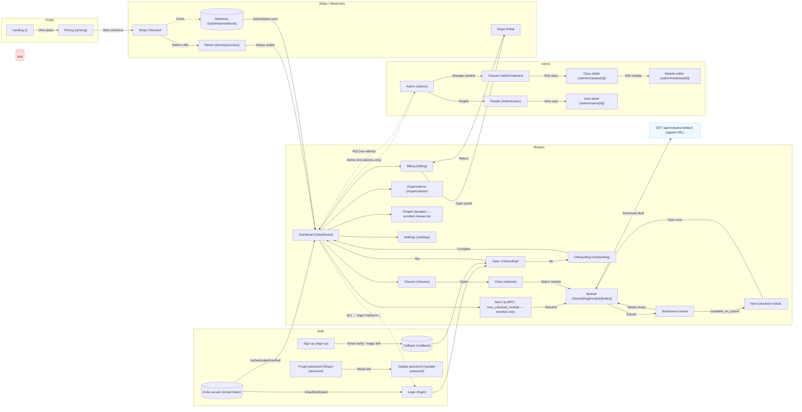

# User Journeys — Proposal (vNext)

This proposal extends the current journeys with missing steps and clearer guard/error states. It adds billing portal loops, invite acceptance, assignment revise/resubmit behavior, and deck download via signed URLs.

Scope clarifications
- Next Up: Computed by `next_unlocked_module` (restricted to enrolled classes) to avoid surfacing content from non‑enrolled classes.
- Invite acceptance: Proposed `/invite/:token` that either prompts auth or directly enrolls and redirects to the dashboard.
- Revise/resubmit: Learners can resubmit even if `complete_on_submit` marked the module complete; this flags the module for review. Consider whether a “revise” state should pause downstream unlocking.
- Billing portal: Include a portal loop so learners can manage payment method/invoices and return to `/billing`.
- Deck downloads: Diagram shows server‑mediated signed URL endpoint for private PDFs.
- Guards/errors: Explicit 401/403/404 encourages well‑defined UX for unauthenticated, unauthorized, and not‑found states.

Open questions
- Should “Needs revise” roll back `module_progress` from completed, or overlay a badge without blocking progression?
- Invite acceptance UX: do we offer lightweight signup within `/invite/:token`, or always require login first?
- People page: when RLS permits, should learners see per‑class rosters and mentor roles?
- Admin audit: do we persist an audit table (not just logs) for enroll/unenroll/invite with RLS for admins?

Next steps
- Decide on the “revise rolls back completion” policy and update module state logic accordingly.
- Add `/invite/:token` route and server action to validate tokens and enroll users.
- Extend People page once roster reads are permitted by RLS.
