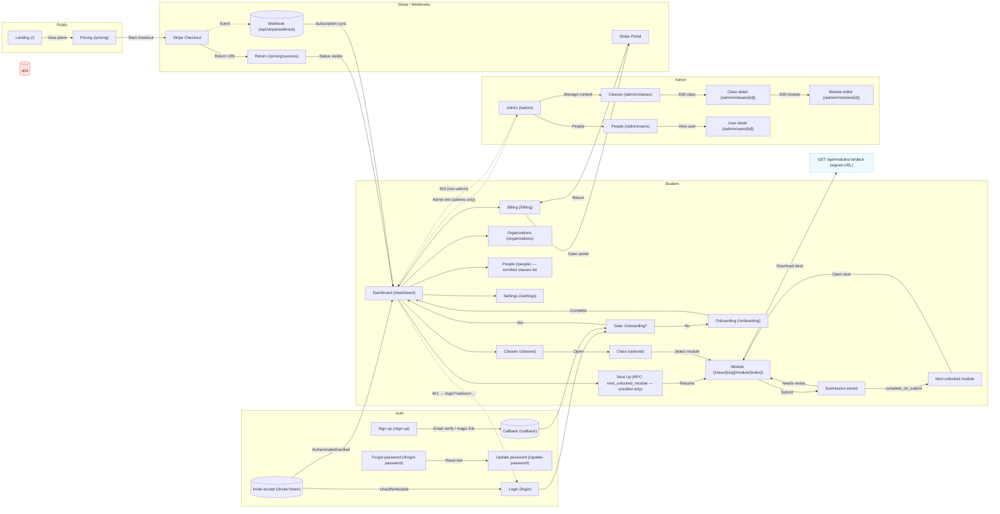

# User Journeys — Coach House LMS

The diagram below maps the primary user flows across Public, Auth, Student, Admin, and Stripe/Webhooks. It reflects current routes, guards, and key states described in docs/AGENTS.md and implemented across the app.

Notes
- Guards: All protected routes redirect unauthenticated users to `/login?redirect=…`. Admin routes redirect non‑admins back to the dashboard. 404 is shown for missing classes/modules.
- Next Up: Derived by RPC `next_unlocked_module` (enrolled classes only) and renders a deep link to the next available module.
- Module progression and assignments: Submissions persist; when `complete_on_submit` is true, submission marks the module complete and advances Next Up. “Needs revise” allows resubmission; policy on pausing progression can be decided.
- Billing: `/billing` opens Stripe Customer Portal and returns to `/billing`; webhook sync keeps subscription status accurate on the dashboard.
- Decks: Private PDF downloads are served via server endpoint that creates a short‑lived signed URL.
- People: Student People page currently lists enrolled classes; per‑class rosters can be added later with RLS.

Tip: You can paste this mermaid block into GitHub comments, issues, or Markdown viewers that support Mermaid to see the rendered diagram.
